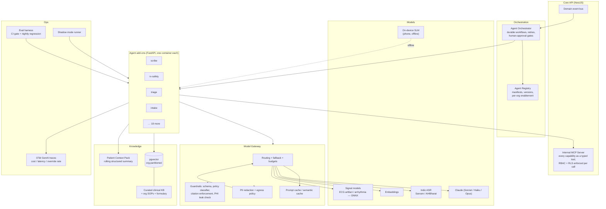
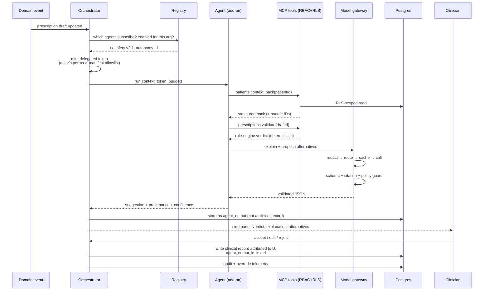

# Aetos One Medical Hub — AI Agent Layer Architecture

**Companion to:** `Aetos-One-Medical-Hub-Architecture.md`
**Version:** 1.2 (open-source composition applied)
**Date:** 13 September 2026
**Scope:** One AI agent per backend service, the runtime they all share, and the 2026-era stack that runs them.

> **v1.2 changes** (from the OSS Composition review): durable execution is **DBOS Transact TS (MIT)** on the existing Postgres, not a hand-rolled state table (§1.4); the model gateway is **LiteLLM (MIT)** rather than built from scratch (§1.5); ASR split between **IndicConformer (MIT, gated — mirror the weights)** and the **Whisper family (MIT)**; signal processing is **NeuroKit2 + ONNX Runtime (both MIT)** and **py-ecg-detectors (GPL-3.0) is banned** (§3).
>
> **v1.1 changes** (from the Scalability Review): Temporal deferred — BullMQ through phase 4 behind a swappable interface (§1.4); agent hosting model changed from one-container-per-agent to a shared agent host with dedicated containers only where earned (§1.7); AI cost made a pricing decision rather than an absorbed overhead (§7).

---

## 0. The one rule that shapes everything below

**In this system an agent proposes; a human or a deterministic engine disposes.**

No agent writes to a clinical record, signs a prescription, changes a dose, closes an alert, or grants access on its own. Drug interactions are decided by a rule engine reading a curated catalogue — the LLM *explains* the decision, it never *makes* it. Every agent output that reaches a clinician carries provenance (which model, which version, which sources, what confidence) and is one click away from being rejected.

This is not timidity. It is the only posture under which an LLM can touch Indian clinical workflows without becoming the thing that gets you sued or deregistered. MoHFW telemedicine guidelines place responsibility on the *registered practitioner* — an architecture that lets software prescribe puts that liability nowhere.

**Autonomy ladder** — every agent in the catalogue is tagged with one:

| Level | Meaning | Example |
|---|---|---|
| **L0 — Observe** | Reads, scores, surfaces. Writes nothing anywhere. | Audit Anomaly Agent |
| **L1 — Draft** | Produces a draft a human must accept, edit or reject. Nothing persists until accepted. | Scribe Agent (SOAP note) |
| **L2 — Act on non-clinical data** | Writes autonomously, but only to operational records, always reversible, always audited. | Scheduling Agent filling a waitlist slot |
| **L3 — Act with policy guard** | Writes autonomously within a hard-coded policy envelope; any exit from the envelope demotes to L1. | Adherence Coach sending a vernacular reminder |

**Nothing in this system is ever above L3.** There is no L4.

---

## 1. Runtime architecture

### 1.1 Shape: agents as add-ons

Same pattern you already use in Home Assistant and in Aetos One Clinics — it works, the team understands it, and it keeps a misbehaving agent out of the core API's process.

```
agents/
  scribe/
    agent.yaml          # manifest: id, version, autonomy, triggers, tools, model policy, scopes
    main.py             # FastAPI service
    prompts/            # versioned, git-tracked, never inline in code
    evals/              # golden set + assertions, runs in CI
    schema/             # JSON Schema for every structured output
```

**`agent.yaml` manifest** (the contract the platform enforces, not a suggestion):

```yaml
id: scribe
name: Consultation Scribe
version: 1.4.0
autonomy: L1
enabled_by_default: false
triggers:
  - event: consultation.audio.chunk
  - event: consultation.ended
tools:                      # exact MCP tool allowlist — anything not listed is unreachable
  - patients.read_summary
  - measurements.read_recent
  - notes.create_draft
scopes:                     # data classes it may see
  - clinical.read
  - audio.transcribe
model_policy:
  primary: claude-sonnet-4.6
  fallback: claude-haiku-4.5
  max_input_tokens: 60000
  max_cost_per_run_inr: 4.00
  pii_egress: allowed_in_region      # allowed_in_region | redacted | on_prem_only
guardrails:
  - output_schema: schema/soap_note.json
  - require_citations: true
  - clinical_policy_classifier: true
  - no_diagnosis_assertion: true
health: /healthz
per_org_config:
  languages: [en, te, hi]
  redact_identifiers: true
```

Orgs enable, configure and disable agents individually. An org on a basic plan runs none of them; a hospital chain runs all of them with their own language and threshold settings. **Every agent ships disabled.**

### 1.2 Platform components



### 1.3 Why MCP is the tool layer

Every platform capability an agent may use is published as a typed MCP tool by the Core API, **not** as a raw HTTP call.

- The MCP server runs the *same* RBAC guards, care-relationship checks and Postgres RLS as a human request. An agent acts as a **service principal with a delegated, scoped token** — it inherits the permissions of the user whose action triggered it, intersected with its manifest allowlist. An agent triggered by Dr. Mehta cannot read a patient Dr. Mehta cannot read.
- The allowlist in `agent.yaml` is enforced at the gateway, so prompt injection in a lab report PDF cannot make the Document agent call `prescriptions.sign` — that tool is not in its map at all.
- The same MCP server, with a human-held token, is what lets you drive the platform from Claude Code — one implementation, two consumers.

**Prompt injection is the real threat here, not model error.** Patient-supplied text, uploaded PDFs, OCR output and ASR transcripts are all untrusted input that reaches a model with tools attached. Controls: strict tool allowlists, untrusted content fenced in delimited blocks with a standing instruction that content inside is data, no tool may be called as a *result* of instructions found in content, and every agent-initiated write requires either L2/L3 policy clearance or a human accept.

### 1.4 Orchestration

- **Short, single-shot agents** (classify, summarise, score): BullMQ job → agent HTTP call → result event. No workflow engine needed.
- **Multi-step, long-running or human-gated** (intake interview, credentialing, ABDM consent dance): a `WorkflowEngine` interface with **two implementations**.
  - **Phases 0–4: DBOS Transact TS (MIT)** — TypeScript-native durable execution as a *library* backed by the Postgres you already run. No extra cluster, no control plane, no new on-call surface, and resume-on-restart comes with it rather than being hand-rolled. BullMQ stays for plain fire-and-forget jobs. Temporal is the right answer for durable human-gated workflows *and* it is a cluster with its own database, upgrade cycle and failure modes. Running one to orchestrate four workflows is operational load bought ahead of need.
  - **Introduce Temporal** when either trigger fires: more than about five genuinely durable human-gated workflows, or the first time a multi-step flow is lost to a restart. The interface makes the swap contained; write the interface on day one so that stays true.
  - What is *not* acceptable either way: hand-rolled cron plus status columns with no resume semantics. That is Temporal, rebuilt badly, with none of the replayable history.
- **Streaming interactive** (live consult copilot, scribe): the agent holds a session on the realtime gateway, emits partial results over WS, and commits only on completion.

### 1.5 Model gateway

**Implementation: LiteLLM (MIT)**, not built from scratch. Virtual keys, **budget controls and spend tracking**, caching, guardrails, load balancing, retry/fallback routing, observability callbacks and the admin dashboard are all in the MIT tier — which is exactly the gateway specified below. ⚠️ **Audit logs are enterprise-licensed only**; for a DPDP-regulated platform, log key issuance and changes at the application layer or buy the licence — plan for it rather than discovering it at audit.

One chokepoint for every model call in the platform. Responsibilities:

| Concern | Implementation |
|---|---|
| Routing | Per-agent model policy from the manifest; automatic fallback on 429/5xx/timeout |
| Cost control | Per-org, per-agent, per-run INR budgets; hard stop with a graceful degrade, not a crash |
| Caching | Prompt caching for the large static prefixes (clinical KB, org SOPs, patient context pack) — the single biggest cost lever, routinely 60–80% on repeated-context agents. Semantic cache for repeated patient-facing FAQs. |
| Egress policy | `pii_egress: on_prem_only` forces a self-hosted model; `redacted` runs the PII redactor first and rehydrates entities in the response; `allowed_in_region` permits a hosted API with a signed DPA and India region |
| Structured output | Every agent returns JSON validated against its schema. A schema failure is a retry, then a hard failure — never a "best effort" parse |
| Observability | OTel GenAI semantic conventions: model, tokens in/out, cache hits, latency, cost, tool calls, and the trace ID that links back to the clinical event |
| Determinism | temperature 0 for anything clinical; a recorded seed and the exact prompt version on every stored agent output |

### 1.6 Memory and knowledge

Three distinct things, routinely conflated and then blamed for hallucination:

1. **Patient Context Pack** — a structured, continuously-maintained summary per patient: active problems, medications, allergies, recent vitals with trends, last three consult summaries, outstanding alerts. Generated by a background agent, **always rendered from real DB rows with IDs**, capped at ~2 000 tokens, and cached as a stable prompt prefix. This is what every clinical agent gets instead of a raw record dump. It is regenerated on every clinical write, never patched by a model in place.
2. **Clinical knowledge base** — curated, versioned, cited: drug monographs, your formulary, guideline extracts, org SOPs and consult templates. Chunked, embedded, stored in **pgvector** partitioned by org (org SOPs never retrieve across tenants). Retrieval is hybrid (BM25 via `tsvector` + vector, reciprocal-rank fused) — pure vector search on drug names and dosages is worse than plain text search, reliably.
3. **Conversation state** — ephemeral, per-run, Redis, TTL'd. Not memory. Never a source of clinical truth.

**Citation is mandatory.** Any agent statement that reads as clinical fact must carry a resolvable source ID — a KB chunk, a measurement row, a prior note. The guardrail rejects uncited clinical assertions before a clinician ever sees them.

---

### 1.7 Hosting model — agent host, not 23 containers

A container per agent reads well in a diagram and costs badly in production. Twenty-three agents at 0.25 CPU / 256 MiB each idle at ~6 CPU / 6 GiB **before serving a request**, with one replica each and no HA. Add integration plugins and it is a 40-container fleet to deploy, monitor, patch and pay for.

**The model instead — three hosting classes, declared in the manifest as `hosting:`**

| Class | Who gets it | Shape |
|---|---|---|
| `shared` (default) | Most agents — event-triggered, low volume, no special dependencies: Access Sentinel, Access Review, Care Continuity, Record Steward, Audit Anomaly, Message Composer, Onboarding, Credentialing, FHIR Mapper, Insights | One **agent host** process loads many agent modules. Isolation is per-run (own token, own budget, own timeout), not per-process. 2–3 replicas of the host, not 2–3 per agent |
| `dedicated` | Latency-sensitive or heavy: Scribe, Live Copilot, Patient Intake, Translator | Own container, own scaling policy, own replica count |
| `inference` | Model servers, not prompts: Signal Quality, Rhythm Screener | ONNX Runtime serving pool shared across the models; on-device copies ship in the apps |

**Rules that keep `shared` safe:** an agent in the shared host is still restricted to its manifest tool allowlist and scopes; a run that exceeds its timeout or budget is killed without touching sibling runs; an agent whose crash rate breaches a threshold is auto-evicted to `dedicated` and an alert is raised. Any agent needing an unusual native dependency is `dedicated` by definition.

**Scale-to-zero** for everything event-triggered rather than on a request path — most of the catalogue runs a few hundred times a day, not continuously.

Net effect: roughly 5–7 containers to operate instead of 23, with the same isolation guarantees on the paths that matter.

---

## 2. Agent catalogue — one per service

23 agents. Column *Aut.* is the autonomy level from §0.

### 2.1 Identity, tenancy, access

| # | Agent | Service | Aut. | What it does | Key tools | Model |
|---|---|---|---|---|---|---|
| 1 | **Access Sentinel** | `identity` | L0 | Scores sign-in and session anomalies — impossible travel, new device on a prescribing account, OTP-farming patterns, credential-stuffing shapes. Explains *why* in one line so an admin can act. | `audit.query`, `sessions.list` | Haiku + statistical baseline |
| 2 | **Onboarding Agent** | `tenancy` | L1 | Conversational org setup: reads a clinic's website/GST/HFR data, proposes branches, roles, staff list and branding, hands the admin a reviewable plan instead of 14 empty forms. | `orgs.*`, `branches.*`, `invitations.create` (all draft-only) | Sonnet |
| 3 | **Access Review Agent** | `authz` | L0 | Continuous least-privilege review: dormant memberships, doctors with access to patients they have not seen in 12 months, role creep, over-broad custom roles, break-glass grants that were never justified. Produces a monthly attestation pack the org owner signs. | `memberships.list`, `access_log.query`, `care.relationships` | Sonnet |
| 4 | **Credentialing Agent** | `directory` | L1 | OCR + verification of NMC registration certificates and degrees, cross-checks name/number/council consistency, flags expiry, drafts the verification decision for a human approver. **Never auto-verifies** — `can_prescribe` is a human-set flag, always. | `documents.read`, `doctors.verify` (draft) | Sonnet + vision |

### 2.2 Patient and care

| # | Agent | Service | Aut. | What it does | Key tools | Model |
|---|---|---|---|---|---|---|
| 5 | **Record Steward** | `patients` | L1 | Duplicate-patient detection across name/DOB/phone/ABHA variants (transliteration-aware — "Ramakrishna" / "Rama Krishna" / "రామకృష్ణ"), demographic normalisation, merge proposals with a full field-level diff. Merges are irreversible, so they are always human-confirmed. | `patients.search`, `patients.merge` (draft) | Sonnet + phonetic matching |
| 6 | **Care Continuity** | `care` | L0 | Finds patients falling through gaps: no follow-up after an abnormal reading, discharged with no assigned clinician, referral accepted but never actioned, chronic patient with no contact in 90 days. Ranked worklist per branch, not a wall of alerts. | `care.*`, `appointments.query`, `measurements.trends` | Sonnet |
| 7 | **Scheduling Agent** | `scheduling` | L2 | No-show probability per appointment (from history, lead time, distance, prior behaviour), automatic waitlist fill on cancellation, overbooking suggestions within a ceiling the org sets, smart reminder timing. Operational data only — reversible, audited, never touches clinical records. | `slots.*`, `appointments.*`, `notifications.send` | Haiku + gradient-boosted model |
| 8 | **Patient Intake** | `consultation` | L1 | Pre-consult structured history, in the patient's language, voice or text, on the phone. Adaptive questioning (OPQRST for pain, red-flag screening), builds the *subjective* section before the doctor joins. Hard rule: **it never offers a diagnosis, a drug, or reassurance** — red flags route to "seek care now" and notify the clinic. | `patients.read_own`, `intake.submit` | Sonnet + Indic ASR |

### 2.3 The consult itself

| # | Agent | Service | Aut. | What it does | Key tools | Model |
|---|---|---|---|---|---|---|
| 9 | **Scribe** | `consultation` | L1 | Ambient documentation. Streams consult audio → diarised transcript → structured SOAP note with ICD-10 candidates, in English from Telugu/Hindi/English speech. Doctor edits and accepts; nothing is stored as a note until accepted. Transcript retention is per-org policy and consented per consult. | `notes.create_draft`, `patients.context_pack` | Sonnet + Sarvam/AI4Bharat ASR |
| 10 | **Live Copilot** | `consultation` | L1 | In-consult side panel: surfaces the relevant prior reading the moment a symptom is mentioned, flags a contradiction with the record ("patient says no diabetes; metformin prescribed March"), suggests the next history question, shows the trend chart the doctor was about to open. Suggestions only — dismissible, never modal. | `measurements.read`, `prescriptions.read`, `kb.search` | Haiku for latency, Sonnet on demand |
| 11 | **Translator** | `consultation` | L3 | Real-time bidirectional speech translation when doctor and patient do not share a language. Policy envelope: medical terms come from a curated glossary, not free translation; any low-confidence segment is shown as text to both parties instead of spoken. | `glossary.lookup` | Streaming ASR + MT |

### 2.4 Devices and telemetry

| # | Agent | Service | Aut. | What it does | Key tools | Model |
|---|---|---|---|---|---|---|
| 12 | **Device Doctor** | `devices` | L1 | Diagnoses BLE failures from uploaded device logs — exactly the class of problem that cost four build cycles on the BP cuff. Learns a vendor/OEM/Android-version compatibility matrix from real field logs, proposes the fix ("this characteristic declares notify *and* indicate; the client chose indicate"), and drafts a support reply. | `devices.logs`, `device_models.read`, `kb.search` | Sonnet |
| 13 | **Signal Quality** | `telemetry` | L3 | Classifies ECG segments as clean / motion artifact / lead-off / baseline wander **on the phone, offline**, and tells the patient to retake *before* the reading is filed. Policy envelope: it can only mark quality and prompt a retake; it cannot discard, alter or re-time a reading. | local ONNX | On-device CNN (~2 MB) |
| 14 | **Vitals Interpreter** | `telemetry` | L1 | Turns numbers into clinical language with trend context: "183/118 — stage 2 hypertension; third reading above 160 systolic in ten days; previous three-month mean 138/88." Produces the doctor-facing one-liner and a separate plain-language patient-facing version. Cites the exact measurement IDs. | `measurements.*`, `kb.search` | Sonnet |
| 15 | **Rhythm Screener** | `telemetry` | L1 | Screening-grade arrhythmia detection on ECG (AF, ectopy, bradycardia/tachycardia) with a confidence band and the flagged segment highlighted. **Labelled "screening, not diagnostic" everywhere it appears**, and it never suppresses a trace from clinician review. Regulatory note: claiming diagnostic performance turns this into a regulated medical device — the labelling is a legal boundary, not a disclaimer. | ONNX inference service | ECG DNN + Sonnet for phrasing |

### 2.5 Alerts, prescribing, adherence

| # | Agent | Service | Aut. | What it does | Key tools | Model |
|---|---|---|---|---|---|---|
| 16 | **Triage Agent** | `alerts` | L2 | Fuses vitals, trends, symptoms and history into a deterioration score; ranks the branch's open alerts; **suppresses duplicate and known-benign alerts** to fight alert fatigue — the failure mode that kills real clinical alerting systems. Suppression is itself logged and reviewable; a critical-severity alert can never be suppressed. | `alerts.*`, `measurements.trends`, `patients.context_pack` | Sonnet + scoring model |
| 17 | **Rx Safety** | `prescriptions` | L1 | Second pair of eyes on every draft prescription: interactions, duplicate therapy, renal/hepatic dose adjustment, paediatric and geriatric dosing, pregnancy category, allergy cross-reactivity, MoHFW O/A/B category vs consult mode. **The deterministic rule engine decides pass/block; the agent writes the explanation and proposes the alternative.** An LLM is never the source of a drug fact. | `drugs.*`, `prescriptions.validate`, `patients.context_pack` | Sonnet + rules engine |
| 18 | **Adherence Coach** | `adherence` | L3 | Patient-facing, in their language, on their channel: dose reminders that adapt to their actual pattern, refill nudges, plain explanations of why a drug matters. Policy envelope — it may send from an approved template set, about a *currently active* prescription only. Any clinical question from the patient escalates to the clinic; it never adjusts a dose or answers "should I stop taking this?". | `schedules.read`, `notifications.send`, template library | Haiku |

### 2.6 Documents, communication, interoperability

| # | Agent | Service | Aut. | What it does | Key tools | Model |
|---|---|---|---|---|---|---|
| 19 | **Document Intelligence** | `documents` | L1 | Lab report PDF/photo → structured FHIR Observations with units, reference ranges and abnormal flags. Handles the reality of Indian lab reports: dozens of layouts, scans, photos, mixed fonts. Every extracted value is anchored to a bounding box so a human can verify it in one glance. Confidence below threshold → human keys it. | vision OCR, `labreports.create_draft` | Sonnet vision + layout model |
| 20 | **Message Composer** | `notifications` | L3 | Renders every outbound message: right channel, right language, right reading level, WhatsApp template compliance. Policy envelope: approved templates + variable substitution; free-form generation only for non-clinical operational messages. | template library, `patients.read_prefs` | Haiku |
| 21 | **FHIR Mapper** | `abdm` | L1 | Maps internal records to ABDM-profile FHIR R4 bundles and back, reconciles incoming HIU data against existing records, explains validation failures in terms a developer can act on. Validation is a real FHIR validator; the agent handles the mapping judgement and the edge cases. | `abdm.*`, FHIR validator | Sonnet |

### 2.7 Platform operations

| # | Agent | Service | Aut. | What it does | Key tools | Model |
|---|---|---|---|---|---|---|
| 22 | **Audit Anomaly** | `audit` | L0 | Watches the access log for the patterns that precede a data incident: bulk record browsing, a front-desk account reading clinical fields, off-hours access spikes, break-glass used without a plausible reason, an exiting employee's export activity. Daily digest plus real-time critical flags to the DPO. | `audit.query`, `access_log.query` | Sonnet |
| 23 | **Insights Agent** | `reporting` | L1 | Natural language over org-scoped, RLS-enforced **views** (never raw tables): "show BP control rates by branch for the last quarter". Generates SQL, runs it read-only under the asking user's own permissions, renders the chart, and shows the SQL so it can be checked. Cross-tenant queries are structurally impossible, not policy-prevented. | `reporting.query_views` | Sonnet |

**Plus one non-agent MCP surface:** the **Platform Ops MCP server** — the same internal MCP tools exposed externally with a human-held token, so you can drive deployments, inspect a tenant, or debug a consult from Claude Code. Not an agent; a tool surface for you.

---

## 3. Technology choices

| Layer | Choice | Why this and not the alternative |
|---|---|---|
| Agent runtime | **Python 3.12 + FastAPI**, HA-addon-style manifest, hosted per §1.7 (shared agent host by default, dedicated container where earned) | Matches the Clinic AI pattern you already run; the ML/ASR/vision ecosystem is Python; process isolation means a leaking agent cannot take down the API |
| Core API | TypeScript / NestJS | Per the main architecture doc; agents are called out to, not embedded |
| Tool protocol | **MCP** for every agent→platform call | One permission-enforcing surface, reusable by Claude Code, and an allowlist that neuters prompt-injection tool abuse |
| Durable orchestration | **DBOS Transact TS (MIT)** through phase 4, behind a `WorkflowEngine` interface; BullMQ for fire-and-forget; **Temporal (MIT)** at >5 durable human-gated workflows or the first restart-lost flow. **Restate is excluded — BSL 1.1, source-available, not open source** | Temporal is the right destination and the wrong starting point — it is a cluster to run for four workflows. The interface makes the swap cheap; starting with it is not |
| Reasoning models | **Claude** — Sonnet for clinical reasoning, Haiku for latency/volume, Opus reserved for offline eval-set grading and hard analysis | You already build on Anthropic; strong structured-output and tool-use behaviour; prompt caching is the main cost lever |
| Speech | **AI4Bharat IndicConformer 600M (MIT)** for Telugu/Hindi; **Whisper / faster-whisper / whisper.cpp (MIT, code *and* weights)** for English and code-mixed English-Hindi; Sarvam Saaras only as a paid API fallback | Whisper's Telugu WER is poor — route Telugu to IndicConformer. ⚠️ **IndicConformer's HuggingFace repo is gated**: the licence is MIT but the download needs an accepted-terms token, so **mirror the weights into your own artifact store** or CI breaks. `whisper.cpp` also gives you the Android/offline path. **Sarvam Saaras has no open weights — it is a vendor dependency, not a component** |
| Reasoning, self-hosted | **Sarvam-M (24B) and Sarvam 30B / 105B — Apache-2.0, ungated** | Indic-tuned open weights with no strings; the right home for high-volume, low-complexity agents once volume justifies self-hosting. *Sarvam Shuka-1 is Llama-3-licensed, not OSI-open — legal sign-off needed, and it is audio-QA, not ASR* |
| Translation | **IndicTrans2 (MIT — code and weights)**, CTranslate2 inference | Cleanest Indic licence available; drives Indian-language prescription instructions and patient messaging |
| Medical NLP guardrail | **scispaCy (Apache-2.0 including the models)**; medspaCy (MIT) for negation and section detection | A deterministic validation layer behind the LLM, not the primary pipeline. **Apache cTAKES is excluded — no release since Sep 2023 and a UMLS licence burden.** ⚠️ UMLS linking requires a signed UMLS agreement |
| Signal processing | **NeuroKit2 (MIT, v0.2.13 Mar 2026)** for ECG/PPG/RSP; BioSPPy (BSD-3), wfdb-python (MIT), torch_ecg (MIT, no weights shipped) | 🚨 **`py-ecg-detectors` is GPL-3.0 and must never enter the codebase** — copyleft in a closed backend is a licence breach, and NeuroKit2 implements the same detector families (Pan-Tompkins, Hamilton, Christov, Engzee) under MIT |
| Signal models | **ONNX Runtime + ONNX Runtime Android (MIT, Maven Central, ungated)** — ECG artifact + rhythm screening, on-device and server | Deterministic, cheap, auditable, offline on the phone, and the shortest PyTorch→Android path. An LLM has no business reading a waveform. *LiteRT is fine on licence but drags in a TF training stack; MediaPipe is a vision framework and adds nothing for 1-D biosignals* |
| Training data | **PTB-XL (CC BY 4.0), MIT-BIH (ODC-By), PhysioNet/CinC Challenge 2020 (CC BY 4.0)**; **ECG-FM (MIT, ungated)** as a starting foundation model | All permit commercial use and none are share-alike, so **your trained weights are yours** — but attribution is enforceable: ship a `DATA_ATTRIBUTION.md`. ⚠️ All are Western/Chinese cohorts; **Indian validation data is required before any clinical claim**, and a diagnostic claim is what pulls the Rhythm Screener into CDSCO Class C |
| Embeddings + vector | **pgvector** in the existing Postgres, HNSW index, org-partitioned | One database. A separate vector DB is a second thing to secure, back up and keep RLS-consistent, for no benefit at this scale |
| Retrieval | Hybrid: `tsvector` BM25 + vector, reciprocal rank fusion, then a rerank pass on the top 50 | Pure vector search is measurably worse on drug names, dosages and codes |
| Guardrails | JSON Schema validation, a clinical policy classifier, citation enforcement, PHI-leak scan on egress, a curated refusal set | Layered and cheap. The schema catches most of it before a model-based check is needed |
| PII handling | Presidio-style redaction with an Indian-entity pack (Aadhaar, ABHA, PAN, phone formats), reversible tokens rehydrated after the call | Lets `redacted` egress mode work without destroying the clinical meaning |
| Evals | Golden sets per agent (≥100 cases for clinical agents), assertion + LLM-judge scoring, **CI gate on every prompt change**, nightly regression, drift alarm | A prompt edit is a production change. Untested prompt edits are how these systems quietly get worse |
| Rollout | **Shadow mode → suggest mode → enabled**, per org, per agent, behind a flag | Shadow mode runs the agent on real traffic and logs what it *would* have said, with zero user exposure. This is how you earn the right to turn something on in healthcare |
| Observability | OTel GenAI semconv; per-run trace linked to the clinical event; dashboards for cost, latency, schema-failure rate, and **human override rate** | Override rate is the single most honest quality metric you will have. A scribe whose notes are rewritten 60% of the time is not working, whatever the eval score says |
| On-device | Small ONNX models + an optional 1–3 B SLM (Gemma/Phi class) via MediaPipe for offline phrasing | The patient app works offline today. Signal quality and reminders must keep working with no network |

**Data residency:** all model traffic carrying identifiable clinical data goes to India-region endpoints under a signed DPA, or to self-hosted models. Any agent that cannot meet this is configured `pii_egress: redacted` or `on_prem_only` in its manifest — enforced at the gateway, not left to the agent's own code.

---

## 4. How an agent run actually flows



Note the two separate tables: **`agent_output`** is what the model said; the clinical record is what the human accepted. They are joined but never the same row. When someone asks in two years whether an AI wrote a note, the answer is in the data.

### 4.1 New tables

| Table | Columns (abridged) |
|---|---|
| `agent` | `id, key, version, autonomy, manifest_json, is_global` |
| `agent_org_config` | `agent_id, org_id, enabled, mode(shadow/suggest/on), config_json, monthly_budget_inr` |
| `agent_run` | `id, agent_id, org_id, trigger_event, actor_user_id, started_at, ended_at, status, model, tokens_in, tokens_out, cache_hits, cost_inr, trace_id, error` |
| `agent_output` | `id, run_id, output_json, schema_version, prompt_version, confidence, citations[], guard_results, presented_at` |
| `agent_decision` | `id, output_id, decided_by, decision(accepted/edited/rejected), edit_diff, decided_at, resulting_record_type, resulting_record_id` |
| `agent_eval_result` | `agent_id, version, eval_set, score, passed, run_at, commit_sha` |

`agent_decision` is the override-rate table and the medico-legal audit trail in one. It is the most important table in this half of the system.

---

## 5. Safety engineering

| Failure mode | Control |
|---|---|
| Hallucinated clinical fact | Citation enforcement — uncited clinical assertions are blocked pre-display. Drug facts come from the catalogue, never the model |
| Prompt injection via lab report / transcript / patient text | Untrusted content fenced and labelled as data; tool allowlist per agent; no tool call may be triggered by instructions found inside content; agents that read untrusted content get read-only tool sets |
| Alert fatigue | Triage agent suppression with logged rationale; critical severity never suppressible; weekly suppression review |
| Automation bias (clinician rubber-stamps AI) | Suggestions are never pre-filled into signable fields; the accept action is explicit and attributed; override rate monitored per clinician, and an implausibly low rate is itself a flag |
| Silent degradation after a model or prompt change | CI eval gate, nightly regression, drift alarms on override rate and schema-failure rate, pinned model versions with explicit upgrade runbooks |
| Cost blowout | Per-org and per-run budgets, prompt caching, aggressive Haiku routing, hard stop with graceful degrade |
| Cross-tenant leakage via RAG | Vectors partitioned by org; retrieval always filtered by org before similarity; the Insights agent queries RLS views only |
| Regulatory overreach | Screening-grade labels enforced in the UI; no diagnostic claims in copy; anything approaching a diagnostic claim is a product decision requiring CDSCO review, not a prompt change |
| Bias | Eval sets stratified by language, gender and age; per-stratum score reported; a stratum regression blocks the release |

---

## 6. Phased rollout of agents

Agents are **added to the phases in the main architecture doc**, never ahead of the feature they assist.

| Wave | With platform phase | Agents | Rationale |
|---|---|---|---|
| **A0 — Foundations** | Phase 0–1 | Runtime, registry, MCP tool server, model gateway, eval harness, shadow runner. **Zero user-facing agents.** | Build the rails first. Every agent after this is a manifest plus prompts, not new infrastructure |
| **A1 — Safe wins** | Phase 2 | Device Doctor (13), Signal Quality (14), Vitals Interpreter (15) | Low clinical risk, immediate value, and Device Doctor pays for itself against the exact BLE problems you have already hit |
| **A2 — The consult** | Phase 3 | Scribe (9), Live Copilot (10), Patient Intake (8) | Scribe is the highest-value agent in the product — it gives clinicians their evenings back. Ship it in shadow mode first |
| **A3 — Prescribing** | Phase 4 | Rx Safety (17), Message Composer (20) | Only after the deterministic rule engine is proven in production. The agent explains a system that already works |
| **A4 — Continuity** | Phase 5 | Triage (16), Adherence Coach (18), Care Continuity (6), Scheduling (7) | Needs real history to be useful; a no-show model with no data is a random number generator |
| **A5 — Scale & governance** | Phase 6–7 | Document Intelligence (19), Record Steward (5), FHIR Mapper (21), Audit Anomaly (22), Access Review (3), Insights (23), Credentialing (4), Access Sentinel (1), Onboarding (2), Translator (11), Rhythm Screener (12) | Governance and interop agents matter once there is scale to govern |

Every agent goes **shadow (≥2 weeks, ≥200 real cases) → suggest (opt-in orgs) → default-on**, with the override rate as the gate between stages. No agent goes default-on with an override rate above 25%.

---

## 7. Cost and latency budget

Indicative, per consultation, with prompt caching working:

| Agent | Calls/consult | Latency target | Est. cost |
|---|---|---|---|
| Patient Intake | 8–15 turns | < 2 s/turn | ₹3–6 |
| Scribe (ASR + note) | streaming + 1 | note < 20 s after end | ₹4–8 |
| Live Copilot | 3–8 | < 1.5 s | ₹1–3 |
| Vitals Interpreter | 1–3 | < 3 s | ₹0.5–1 |
| Rx Safety | 1–2 | < 4 s | ₹1–2 |
| **Total** | | | **₹10–20 per consult** |

Against a typical ₹300–800 consultation fee this is 2–5% of revenue — defensible, but only with caching and Haiku routing. Without them it is 3–4× higher. Budget enforcement belongs in the gateway from day one, not added after the first surprising bill.

### 7.1 AI cost is a pricing decision, not an overhead

Infrastructure cost per consult **falls** with scale — fixed costs amortise. AI cost per consult **does not**: it is linear in volume, forever.

| Volume | AI spend/month |
|---|---|
| 500 consults/day | ₹1.5–3 lakh |
| 10 000 consults/day | **₹30–60 lakh** |
| 100 000 consults/day | ₹3–6 crore |

This has a hard product consequence: **at a ₹100 consult fee, ₹15 of AI is 15% of revenue before any other cost.** A low-fee, freemium or high-volume/low-margin model does not survive contact with this table.

So the design treats AI as a metered product line, not a feature:

- **AI is a paid tier.** Base plan runs the platform with zero agents enabled — the product must be complete and sellable without them (it already is; every agent ships disabled). Agents are a per-seat or per-consult add-on.
- **Per-org monthly budgets are enforced at the gateway**, visible to the org admin, with a graceful degrade (agent silently steps aside; the clinician's workflow is unaffected) rather than an error.
- **Cost per consult is a tracked SLI**, alongside latency and override rate. A prompt change that doubles cost is a regression and should fail review the same way a latency regression does.
- **Self-host the high-volume, low-complexity agents** once volume justifies it — Message Composer and Adherence Coach are template-shaped work that a small self-hosted model does adequately, and they are the highest-call-count agents in the catalogue.
- **Prompt caching is not an optimisation, it is load-bearing.** 60–80% of the bill. Any agent whose prompt structure defeats caching (varying prefix, unstable context pack) is a bug, not a design choice.

---

## 8. What I would push back on

- **23 agents is a catalogue, not a plan.** Ship A0 + A1 + Scribe and you have most of the realised value. The rest are real, but each one is a prompt, an eval set, a shadow period and an owner — treat every "enable" as a product launch.
- **Scribe is the killer feature, not the copilot.** Ambient documentation in Telugu/Hindi is what makes an Indian clinician change software. Build it properly rather than spreading the effort across twenty half-agents.
- **The on-device signal models matter more than they look.** They are what keeps the product working in the villages where a water-plant-style deployment actually lives, and they are cheap and deterministic.
- **Do not let an agent near prescribing until the rule engine is boring.** The agent's job there is explanation, and explanation of a system that is not yet correct is worse than no explanation.

---

*Prepared for Ramsay, Aetos Tech Labs LLP. Companion to the main Medical Hub architecture. No implementation started.*
