# Aetos One Medical Hub — Plugin & Add-on Architecture

**Companion to:** `Aetos-One-Medical-Hub-Architecture.md` and `Aetos-One-Medical-Hub-AI-Agent-Architecture.md`
**Version:** 1.1 (scalability fixes applied)
**Date:** 13 September 2026
**Scope:** How the platform is split into a small kernel plus plugins, how a plugin is packaged, permissioned and sandboxed, the extension points it can hook, and how external services integrate.

> **v1.1 changes** (from the Scalability Review): added rule 4 — **one multi-tenant deployment serves every org** (§0, §3.1, manifest `tenancy:`); fail-closed sync hooks capped at one plugin each with circuit breakers (§4.2); plugin hosting aligned with the agent hosting classes.

---

## 0. The governing idea

**A small, boring, slow-moving kernel — everything else is a plugin.**

Home Assistant survives ten years of core updates because the core owns identity, state, events and the device abstraction, and almost nothing else. Every integration is replaceable, versioned separately, and cannot take the core down. That is the model here.

```
            ┌─────────────────────────────────────────┐
            │  KERNEL  — small, stable, never forked   │
            │  identity · tenancy · RBAC/RLS · audit   │
            │  event bus · storage · plugin runtime    │
            └─────────────────────────────────────────┘
                              ▲
        ┌──────────┬──────────┼──────────┬──────────────┐
   clinical     device     AI agent   integration    UI / workflow
    modules    protocol     add-ons   connectors     extensions
               packs
```

**Four hard rules that make this work rather than become dependency hell:**

1. **A plugin never touches the database.** Not read, not write, not "just this one query". All data access goes through the kernel's scoped API / MCP tools, which run the same RBAC, care-relationship and RLS checks as a human request. This is the single rule that keeps a bad plugin from becoming a breach.
2. **A plugin declares everything it needs up front, in its manifest, and gets nothing else.** Events, tools, scopes, config, UI slots, network egress. Undeclared is unreachable — enforced at the runtime, not documented as a convention.
3. **The kernel's plugin API is versioned and deprecated on a published schedule.** A plugin pinned to `core >=1.4 <2.0` keeps working across every 1.x release, or the release is wrong. Breaking a plugin is a kernel bug.
4. **One deployment of a plugin serves every org.** "Installed per org" is a *data* boundary — a row in `plugin_installation`, config and a scoped token passed per invocation — never a *process* boundary. One container per org per plugin is O(orgs × plugins) and dies at fifty orgs. This is the single most expensive mistake available in this design and the cheapest one to prevent, so it is a rule, not a guideline.

---

## 1. Plugin types

Eight kinds. All share one manifest format, one lifecycle, one permission model.

| Type | What it extends | Runtime | Examples |
|---|---|---|---|
| **`integration`** | External services | Container add-on | Razorpay, WhatsApp Business, lab LIS, ABDM, Tally, Google Calendar, Aetos One Cloud |
| **`agent`** | AI capability per service | Container add-on | The 23 agents in the AI doc — an agent *is* a plugin with `type: agent` |
| **`device-pack`** | Device protocol support | **Declarative — no code** | ikinloop ECG2, RBP cuff, a new glucometer |
| **`clinical-module`** | Specialty workflow | Container or declarative | Dental charting, ophthalmology, antenatal care, physiotherapy |
| **`ui-extension`** | Web/app surfaces | Sandboxed browser module | Consult side panels, dashboard cards, report widgets |
| **`automation`** | Trigger→condition→action rules | **Declarative — no code** | "BP > 160 twice in 7 days → alert doctor + book follow-up" |
| **`report-pack`** | Analytics | Declarative SQL-over-views + chart spec | NABH quality indicators, branch utilisation |
| **`theme`** | Branding | Declarative CSS variables | White-label packs per org |

**The three declarative types are the important ones.** A device pack, an automation and a report pack are *data*, not code. They install instantly, cannot crash anything, need no security review, and — crucially — can be authored by you or a customer without a release. Push as much as possible into these.

---

## 2. Plugin package and manifest

```
aetos-plugin-razorpay/
  plugin.yaml           # the contract
  README.md
  CHANGELOG.md
  icon.svg
  src/                  # code plugins only
  ui/                   # ui-extension bundle (ESM, no framework lock-in)
  schemas/              # config + data schemas
  translations/         # en, hi, te, ...
  tests/                # contract tests run by the certification harness
  SIGNATURE             # detached signature over the bundle checksum
```

### `plugin.yaml`

```yaml
apiVersion: aetos.plugin/v1
id: razorpay
name: Razorpay Payments
version: 2.1.0
type: integration
vendor: Aetos Tech Labs
tier: official                   # official | verified | community
requires:
  core: ">=1.4 <2.0"             # kernel API range — enforced at install
  plugins: []                    # other plugins this depends on

runtime:
  kind: container                # container | declarative | ui-module | webhook-only
  tenancy: multi                 # multi (required) | dedicated (on-prem connectors ONLY,
                                 #   e.g. hospital LDAP or a local LIS behind a customer VPN)
  hosting: shared                # shared host process | dedicated container | inference pool
  image: ghcr.io/aetostechlabs/plugin-razorpay:2.1.0
  health: /healthz
  resources: { cpu: "0.25", memory: "256Mi" }
  scale_to_zero: true            # event-triggered plugins idle at zero
  egress:                        # network allowlist — everything else is blocked
    - api.razorpay.com

capabilities:                    # what it may do — admin consents to this list at install
  data:
    - invoices:read
    - invoices:write
    - patients:read:demographics # NOT clinical — least privilege is enforced, not advised
  events:
    subscribe:
      - invoice.created
      - appointment.completed
    publish:
      - payment.captured
      - payment.failed
  tools:                         # MCP tool allowlist
    - invoices.mark_paid
    - notifications.send
  ui:
    slots:
      - billing.payment_methods
      - appointment.detail.actions
  webhooks:
    inbound:
      - path: /webhooks/razorpay
        auth: hmac-sha256
        secret_ref: config.webhook_secret

config_schema: schemas/config.json     # rendered as a real form in the admin UI
secrets: [key_id, key_secret, webhook_secret]

scope: org                       # org | branch | platform — installable level
multi_instance: false            # can an org install it twice with different config?

lifecycle:
  on_install: /lifecycle/install
  on_enable: /lifecycle/enable
  on_config_change: /lifecycle/reconfigure
  on_disable: /lifecycle/disable
  on_uninstall: /lifecycle/uninstall   # must be idempotent and must not delete org data
```

**The manifest is the security boundary.** The runtime builds the plugin's token from `capabilities` alone. A plugin asking for `patients:read:clinical` shows the admin a red warning at install; a payments plugin asking for it should be rejected on review.

---

## 3. Runtime isolation tiers

| Tier | Used by | Isolation | Blast radius |
|---|---|---|---|
| **Declarative** | device-pack, automation, report-pack, theme | No code executes. Validated against a JSON Schema, interpreted by the kernel. | None |
| **Container** | integration, agent, clinical-module | Own network namespace, egress allowlist, CPU/memory caps, no DB credentials, scoped token with a short TTL. **Multi-tenant: one deployment, all orgs** (§3.1) | Its own process. Kernel unaffected. |
| **UI module** | ui-extension | Loaded as an ESM module into a sandboxed custom element; no `fetch` except through the host SDK; CSP-restricted; no access to the auth token | One panel renders blank |
| **Webhook-only** | lightweight integrations | Lives entirely outside. Signed inbound webhooks + outbound subscriptions. No install-time trust at all | None |

### 3.1 Multi-tenancy inside a plugin

A container plugin is a **stateless multi-tenant service**. Each invocation carries the org's identity, its configuration and a scoped token; the plugin holds nothing about an org between calls.

| Requirement | Detail |
|---|---|
| No per-org process | One deployment, N replicas sized by *total* load — never by org count |
| No per-org memory state | Config, credentials and cursors are fetched or injected per invocation. A cache is keyed by `org_id` with a TTL and a hard size cap, never an unbounded map |
| Secrets per call | Injected from the kernel vault for that org, scoped to that invocation, never held across calls |
| Fairness | Per-org rate limits and concurrency caps inside the plugin, so one busy hospital chain cannot starve forty clinics |
| Observability | Every metric and log line carries `org_id` — without it a noisy-tenant problem is undiagnosable |
| Scaling signal | Replicas scale on queue depth and p95 latency, not on installation count |

**The one exception** is `tenancy: dedicated`, permitted only where a plugin must terminate a customer-specific private connection — hospital LDAP, an on-prem LIS behind a VPN, a site-local device gateway. Those are connector agents deployed at the customer's edge by necessity, they are counted and reviewed, and no cloud-hosted plugin may declare it.

**Watchdog and kill switch:** the kernel health-checks every container plugin, applies a circuit breaker on repeated failures, degrades to the built-in behaviour, and raises an admin notification. A platform-level kill switch disables a plugin across all orgs in one action — needed the day a community plugin ships a bad release.

---

## 4. Extension points

What a plugin can actually hook. This list is the kernel's public API surface; adding to it is a deliberate versioned act.

### 4.1 Events (the primary mechanism)

The kernel publishes a typed domain event for everything that matters. Plugins subscribe by name or glob. Delivery is at-least-once with an idempotency key; plugins must be idempotent.

```
identity.*      user.registered, user.signed_in, session.suspicious
tenancy.*       org.created, branch.created, membership.granted, membership.revoked
patient.*       patient.created, patient.updated, patient.merged, patient.archived
scheduling.*    appointment.created, .rescheduled, .cancelled, .no_show, .completed
consult.*       consultation.started, .participant_joined, .ended, note.created
telemetry.*     measurement.created, waveform.stored, device.bound, device.offline
alert.*         alert.raised, .acknowledged, .escalated, .resolved
rx.*            prescription.drafted, .signed, .superseded, .dispensed
adherence.*     dose.due, dose.taken, dose.missed, schedule.completed
document.*      labreport.uploaded, attachment.created
abdm.*          carecontext.linked, consent.granted, consent.revoked
billing.*       invoice.created, payment.captured, payment.failed
```

### 4.2 Synchronous hooks

Where a plugin must influence an in-flight operation. These are **narrow and few on purpose** — every sync hook is latency and a failure mode on the critical path. Timeout 2 s, fail-open or fail-closed declared per hook, always logged.

| Hook | Purpose | Fail mode |
|---|---|---|
| `validate.prescription` | Extra safety check before signing (formulary, insurance) | **fail-closed** |
| `validate.appointment` | Capacity or eligibility rules | fail-open |
| `enrich.patient` | Add external identifiers at creation | fail-open |
| `resolve.pricing` | Consultation fee from an external rate card | fail-closed |
| `authorize.document_access` | Extra gate over a sensitive document | fail-closed |
| `transform.notification` | Rewrite an outbound message before dispatch | fail-open |

**Hard limits on sync hooks** — these put third-party latency on a clinician's critical path, so they are capped, not merely documented:

- **At most one plugin may register on a fail-closed hook** (`validate.prescription`, `resolve.pricing`, `authorize.document_access`). Two plugins able to block a doctor from signing is not a feature.
- **Circuit breaker per hook**: after N consecutive calls over budget, the hook trips to its declared fail mode and an alert fires. It re-arms on a half-open probe, not automatically.
- **Hook p95/p99 latency sits on the clinical SLI dashboard**, next to consult join success and measurement ingest lag. If signing gets slow, the cause must be visible in one place.
- **The list is closed at six.** Adding a seventh requires a named customer and a named use case that no event can serve.

### 4.3 UI slots

Named mount points in the web console and the Android apps. A plugin declares a slot and ships a module; the host renders it in a sandbox with a typed context object.

```
nav.sidebar                        patient.detail.tab
dashboard.cards                    patient.detail.summary_widget
consult.side_panel                 prescription.editor.footer
appointment.detail.actions         billing.payment_methods
settings.org.section               reports.catalogue
mobile.patient.home_card           mobile.clinician.queue_action
```

### 4.4 Mounted API routes

A plugin may mount routes under `/api/v1/ext/{plugin-id}/*`. The kernel handles auth, rate limiting and audit before proxying. A plugin can never mount at the root or shadow a core route.

### 4.5 Scheduled jobs

Cron expressions in the manifest, executed by the kernel scheduler with a per-org lock. No plugin runs its own cron.

### 4.6 Provider registrations

A plugin can register itself as an implementation of a kernel-defined interface, and the org picks which one is active:

| Interface | Implementations |
|---|---|
| `NotificationChannel` | WhatsApp, SMS (MSG91 / Gupshup / Twilio), email, push, IVR |
| `PaymentProvider` | Razorpay, PayU, Stripe, cash-only |
| `StorageBackend` | MinIO, S3, Azure Blob |
| `ASRProvider` | Sarvam, AI4Bharat, Whisper self-hosted |
| `IdentityProvider` | Built-in, Google Workspace, Microsoft Entra, hospital LDAP |
| `LabConnector` | HL7 v2, FHIR, SFTP CSV, vendor API |
| `SignatureProvider` | Typed credential, DSC, eSign (Aadhaar) |

This is what makes the platform genuinely portable — a hospital that mandates Entra ID and an on-prem LIS installs two plugins instead of forking your code.

---

## 5. Device Protocol Packs — the one to get right

The BLE work so far cost four build cycles on a single cuff, and the root cause was a client choosing indicate over notify. That knowledge should live in **data**, not in an app release.

```yaml
apiVersion: aetos.plugin/v1
id: device-rbp-bp-cuff
type: device-pack
version: 1.2.0
device:
  vendor: RBP
  kind: bp
  match:
    name_prefixes: ["RBP", "BP_"]
    service_uuids: ["0000fff0-0000-1000-8000-00805f9b34fb"]
ble:
  transport: le                       # explicit — auto fails on cached dual-mode devices
  characteristics:
    measurement:
      uuid: "0000fff1-0000-1000-8000-00805f9b34fb"
      subscribe: notify               # WINS over indicate when both are declared
      fallback: subscribe_all_notifying
  bonding: if_required
  handshake: none                     # cuff sends one frame per completed measurement
decoder:
  frame_length: 20
  header: "aa80"
  fields:
    systolic:  { offset: 10, type: u8, unit: mmHg }
    diastolic: { offset: 12, type: u8, unit: mmHg }
    pulse:     { offset: 14, type: u8, unit: bpm }
  checksum: { algorithm: unknown, verify: false }
  known_good_frame: "aa80020f0106000e010101010100c8008600642f"   # 200/134, pulse 100
ranges:
  systolic:  { normal: [90, 120], warn: [121, 139], critical: [160, 300] }
  diastolic: { normal: [60, 80],  warn: [81, 89],   critical: [100, 200] }
quality:
  min_plausible: { systolic: 60, diastolic: 30, pulse: 30 }
```

**The same pack is consumed by the backend, the patient app and the clinician app.** Packs are fetched at runtime and cached, so **adding a new glucometer is a config change, not a Play Store release cycle.** The `known_good_frame` doubles as a regression test the CI runs against the decoder.

This single pattern is worth more than half the integration catalogue below.

---

## 6. Automations — HA-style, in the clinic

Declarative trigger → condition → action, authored in the admin UI, no code, no YAML for the end user:

```yaml
id: hypertension-followup
trigger:
  - platform: measurement
    kind: bp
    field: systolic
    above: 160
    occurrences: 2
    within: 7d
condition:
  - patient_has_tag: hypertension
  - not_recently_triggered: 14d
action:
  - raise_alert: { severity: warning, assign_to: primary_physician }
  - notify: { channel: whatsapp, template: high_bp_followup, language: patient_preferred }
  - book_appointment: { doctor: primary_physician, within: 3d, mode: video }
```

Familiar to you, and it means a clinic can encode its own protocols without an engineer. Same safety rules as everywhere: an automation can raise, notify and schedule; it cannot prescribe, change a dose, or close a critical alert.

---

## 7. Integration catalogue

| Domain | Plugins | Pattern |
|---|---|---|
| **Payments** | Razorpay, PayU, Stripe, Cash | `PaymentProvider` + inbound webhook |
| **Messaging** | WhatsApp Business (Meta / Gupshup), MSG91, Twilio, SMTP, FCM | `NotificationChannel` |
| **Labs & diagnostics** | HL7 v2 MLLP bridge, FHIR connector, SFTP CSV, vendor APIs | `LabConnector` + Document Intelligence agent |
| **Pharmacy** | Local chain APIs, PharmEasy/1mg style, in-house dispensing | Events + mounted routes |
| **ABDM** | ABHA, HIP, HIU, HFR/HPR sync | Official plugin, FHIR Mapper agent |
| **Insurance / TPA** | Claim submission, pre-auth, eligibility | Mounted routes + sync `validate.prescription` |
| **Hospital systems** | HIS/EMR bridge, DICOM/PACS viewer link | HL7 + FHIR + `ui-extension` |
| **Identity** | Google Workspace, Microsoft Entra, LDAP | `IdentityProvider` (OIDC/SAML) |
| **Accounting** | Tally, Zoho Books, QuickBooks | Scheduled export jobs |
| **Calendar** | Google, Outlook | Two-way sync plugin |
| **Video** | Jitsi (built-in), LiveKit, Zoom | `MeetingProvider` |
| **Your own stack** | **Aetos One Cloud** (device telemetry at fleet scale), **Aetos One Clinics** (practice management), **Home Assistant** (clinic IoT — room temperature, occupancy, cold-chain fridge monitoring), **Aetos One Chat** (WhatsApp platform) | First-party plugins over the public API + MCP |

**Your existing products become plugins of each other.** Aetos One Clinics handles the practice-management side for orgs that want it; the Medical Hub handles devices and teleconsults; Aetos One Cloud aggregates device fleets across sites. One identity, three products, no forking — that is the payoff of building the kernel small.

### 7.1 Integration surfaces the platform exposes outward

| Surface | For |
|---|---|
| **REST API v1** + OpenAPI spec | Any consumer; SDKs generated for TS, Python, Kotlin |
| **FHIR R4 API** | Health systems, ABDM, research; the interop lingua franca |
| **MCP server** | AI consumers — your own agents, Claude Code, a customer's copilot |
| **Outbound webhooks** | Subscriptions per org with HMAC signing, retries with exponential backoff, a replayable dead-letter queue, and a delivery log the customer can inspect |
| **HL7 v2 bridge** | Indian hospital reality — most labs and HIS still speak v2, not FHIR |
| **Bulk export** | NDJSON FHIR bulk + CSV, for analytics and migration |

---

## 8. Registry, install and lifecycle

```mermaid
flowchart LR
    DEV["Developer<br/>builds plugin"] --> CI["CI: contract tests,<br/>schema validation,<br/>SAST + dependency scan"]
    CI --> SIGN["Sign bundle"]
    SIGN --> REG["Plugin Registry<br/>official / verified / community"]
    REG --> STORE["Org admin browses<br/>in-app Plugin Store"]
    STORE --> CONSENT["Capability consent screen<br/>— exactly what it may access"]
    CONSENT --> INST["Install: pull image,<br/>validate manifest vs core version,<br/>run on_install"]
    INST --> CFG["Configure: form rendered<br/>from config_schema"]
    CFG --> EN["Enable → health check →<br/>active"]
    EN --> UPD["Update: semver check,<br/>migration hook, rollback on failure"]
```



**Tiers:** `official` (built by you, supported, auto-update eligible) · `verified` (third-party, reviewed and signed, manual update) · `community` (unsigned, install blocked by default, org owner must explicitly allow, never permitted clinical-write capabilities).

**Uninstall never deletes org data.** It disables, detaches and leaves the data with an orphan marker. Deletion is a separate, explicit, confirmed action — a mis-click must not destroy a year of lab results.

**Per-org, per-branch enablement** with independent config, same as HA add-ons and the agent add-ons.

---

## 9. Versioning and compatibility

| Rule | Detail |
|---|---|
| Kernel API is semver | `aetos.plugin/v1`. Additive changes are minor; a breaking change is a new `v2` running **alongside** v1 for at least two minor releases |
| Plugins pin a range | `requires.core: ">=1.4 <2.0"`. Install is refused outside it, with a clear message — never a silent partial failure |
| Deprecation policy | Announced one minor release ahead, warned in logs and the admin UI, removed no earlier than the next major |
| Contract tests | Every extension point has a kernel-published test suite. A plugin passes it in CI or it is not certified |
| Event schema registry | Every event has a versioned JSON Schema; consumers validate. New optional fields are non-breaking; removals are not permitted within a major |
| Migration hooks | `on_update(from_version)` for plugins that own their own config or external state; failure rolls back to the prior image |

---

## 10. Security model for plugins

| Control | Implementation |
|---|---|
| No database access | Ever. Scoped API / MCP only, RBAC + RLS on every call |
| Scoped token | Built from `capabilities` at enable time, 15-minute TTL, auto-rotated, bound to the plugin identity and the org |
| Egress allowlist | Container network policy from the manifest; anything else fails to connect |
| Secrets | Never in the image or the manifest; stored in the kernel vault, injected at runtime, never returned by any read API |
| Resource quotas | CPU/memory caps, API rate limits per plugin, per-org call budgets |
| Audit | Every plugin data access lands in `access_log` attributed to the plugin identity — an org admin can see exactly what a plugin read |
| Supply chain | Signed bundles, pinned digests (not tags), SBOM, dependency and image scanning in CI, reproducible builds for official plugins |
| Clinical-write gate | `prescriptions:write`, `notes:write` and `measurement:delete` are **not grantable to community plugins at all**, and require review for verified ones |
| Kill switch | Platform-wide disable of a plugin id or version range, effective within one health-check interval |

---

## 11. New kernel tables

| Table | Columns (abridged) |
|---|---|
| `plugin` | `id, key, version, type, tier, manifest_json, signature, published_at, kill_switched` |
| `plugin_installation` | `id, plugin_id, org_id, branch_id, status(installed/enabled/disabled/failed), installed_version, installed_by, consented_capabilities, installed_at` |
| `plugin_config` | `installation_id, config_json, secrets_ref, updated_by, updated_at` |
| `plugin_event_subscription` | `installation_id, event_pattern, endpoint, active` |
| `plugin_invocation` | `id, installation_id, kind(event/hook/route/job), latency_ms, status, error, trace_id, at` |
| `plugin_health` | `installation_id, state, last_check_at, consecutive_failures, circuit_state` |
| `webhook_delivery` | `id, installation_id, event_id, attempt, response_code, next_retry_at, dead_lettered` |
| `device_pack` | `id, version, vendor, kind, spec_json, active` |
| `automation_rule` | `id, org_id, branch_id, spec_json, enabled, last_triggered_at, created_by` |

---

## 12. Refactor of the main architecture

Nothing in the main doc is thrown away — the modules become kernel or plugin:

| Main-doc module | Becomes |
|---|---|
| `identity`, `tenancy`, `authz`, `audit`, `patients`, `care` | **Kernel.** Never a plugin. These define the security model |
| `scheduling`, `consultation`, `telemetry`, `prescriptions`, `documents` | **Kernel core domain** — the clinical spine, with plugin extension points on every step |
| `devices` | Kernel registry + **device-packs** as data |
| `alerts` | Kernel engine + **automation** plugins as rules |
| `notifications` | Kernel dispatcher + **channel provider** plugins |
| `abdm` | **Official plugin** (the core product must work fully without it) |
| `adherence`, `reporting` | Kernel core + **report-pack** plugins |
| All 23 AI agents | **`type: agent` plugins**, one manifest each |

The kernel stays roughly 40% of the codebase and changes slowly. Everything with a vendor name in it lives outside.

---

## 13. Phasing

| Wave | With platform phase | What lands |
|---|---|---|
| **P0** | Phase 0 | Plugin registry tables, manifest schema + validator, capability model, scoped-token issuance, event bus with schemas. **No plugin API published yet** |
| **P1** | Phase 2 | Declarative tiers first: **device-packs** and **report-packs**. Migrate the ECG2 and RBP decoders out of app code into packs. Immediate payoff, zero runtime risk |
| **P2** | Phase 3 | Container runtime, health/watchdog/circuit breaker, lifecycle hooks, agent plugins run on it (the AI doc's A0 rails *are* this runtime) |
| **P3** | Phase 4 | Provider interfaces (`NotificationChannel`, `PaymentProvider`, `ASRProvider`), first integrations: WhatsApp, Razorpay, SMS |
| **P4** | Phase 5 | **Automations**, UI slots and the `ui-extension` sandbox, admin Plugin Store |
| **P5** | Phase 6–7 | Outbound webhooks, FHIR + HL7 v2 surfaces, ABDM as an official plugin, `IdentityProvider` plugins, third-party certification programme |

---

## 14. Blunt assessment

- **The declarative tiers are where the value is.** Device-packs, automations and report-packs are cheap to build, impossible to crash, and cover most of what a customer will ask for. Ship P1 early and you decouple hardware support from Play Store release cycles permanently — that alone justifies this whole document.
- **A third-party plugin ecosystem is probably not your goal and should not be designed for yet.** Build the plugin architecture for *your own* discipline — it forces clean boundaries between the Hub, Clinics and Cloud, and it makes per-customer integrations someone else's problem to maintain. Open it to outsiders only when a customer's vendor demands it.
- **Sync hooks are the trap.** Every one you add is latency on a clinical path and a new way for a third party to block a doctor from signing. Six is already generous. Refuse the seventh unless someone can name the customer.
- **Do not let "plugin" become an excuse to defer decisions.** A pluggable payment provider is real extensibility; a pluggable "clinical workflow engine" is usually an unfinished product wearing an abstraction. Ship the opinionated path, extend where a real customer forces it.

---

*Prepared for Ramsay, Aetos Tech Labs LLP. Third of three architecture documents for the Medical Hub. No implementation started.*
