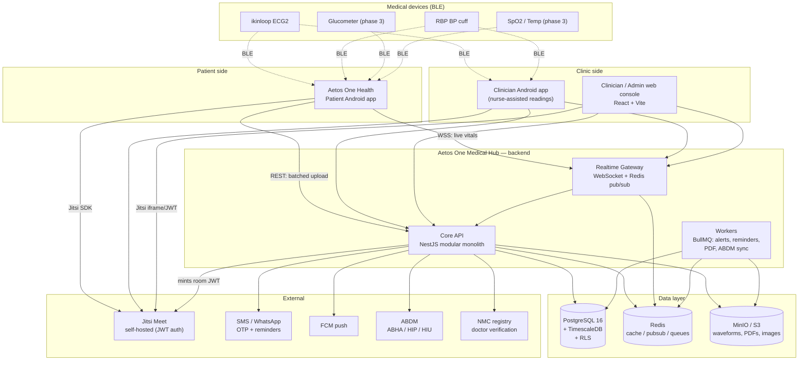
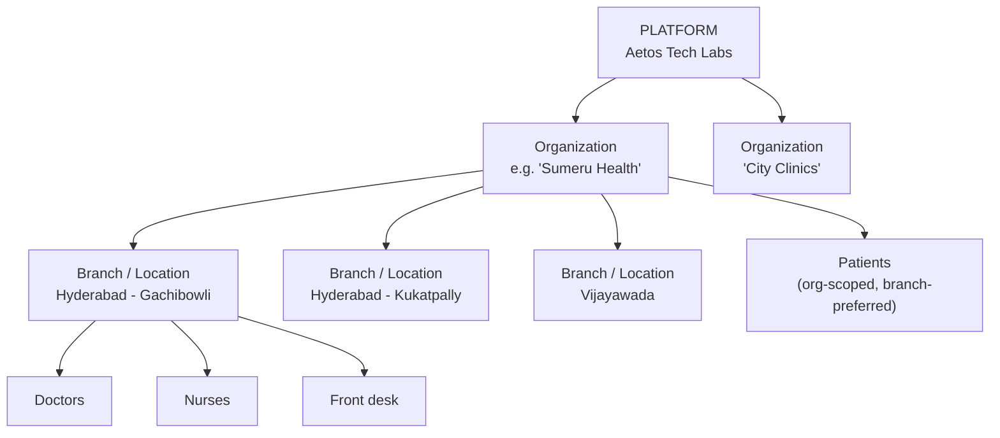
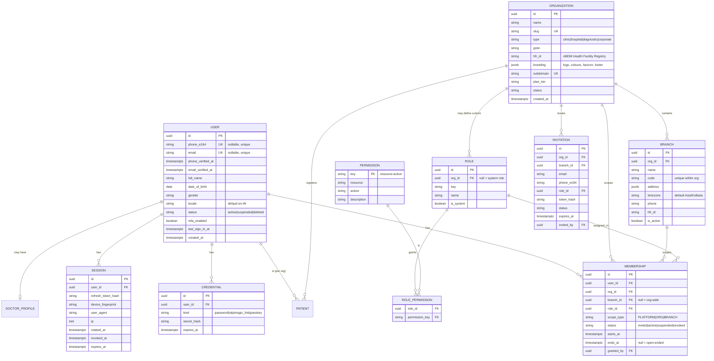
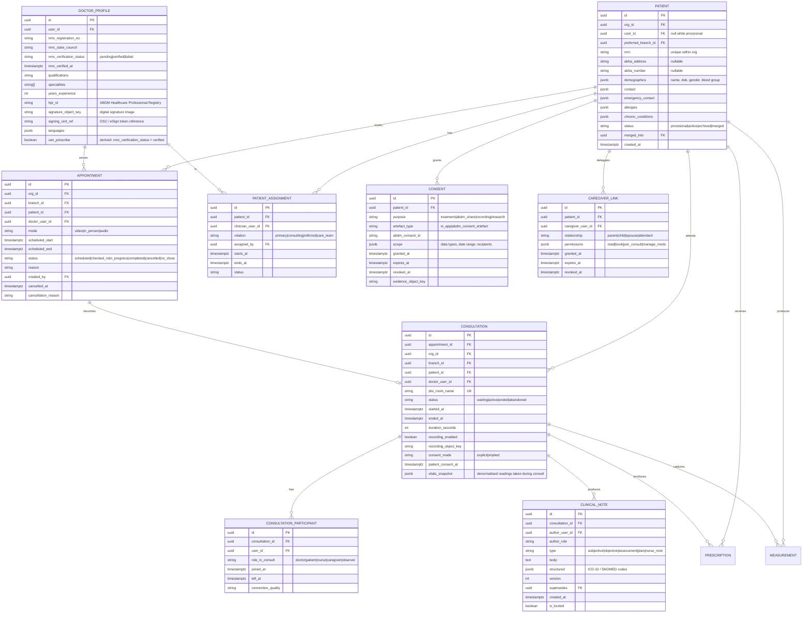
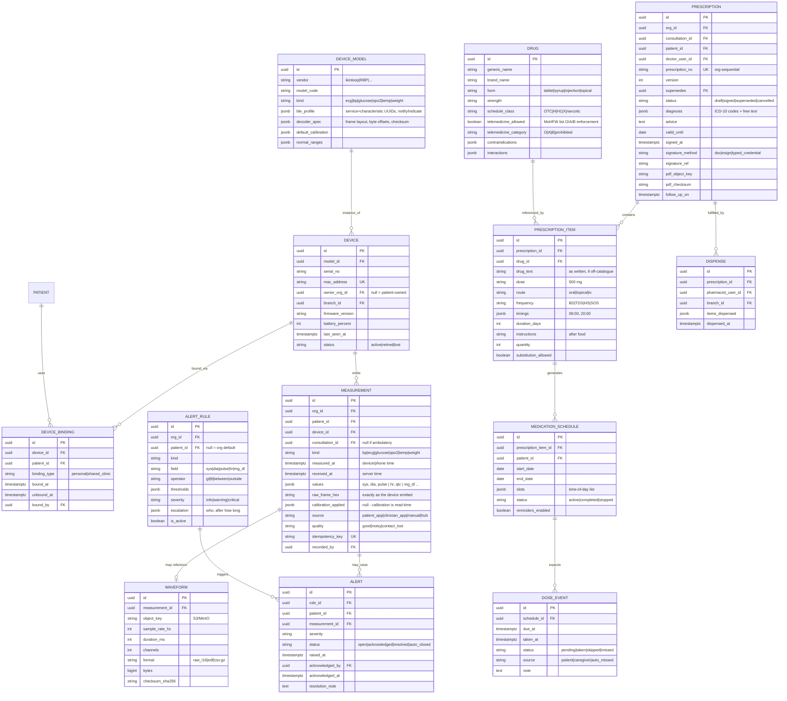
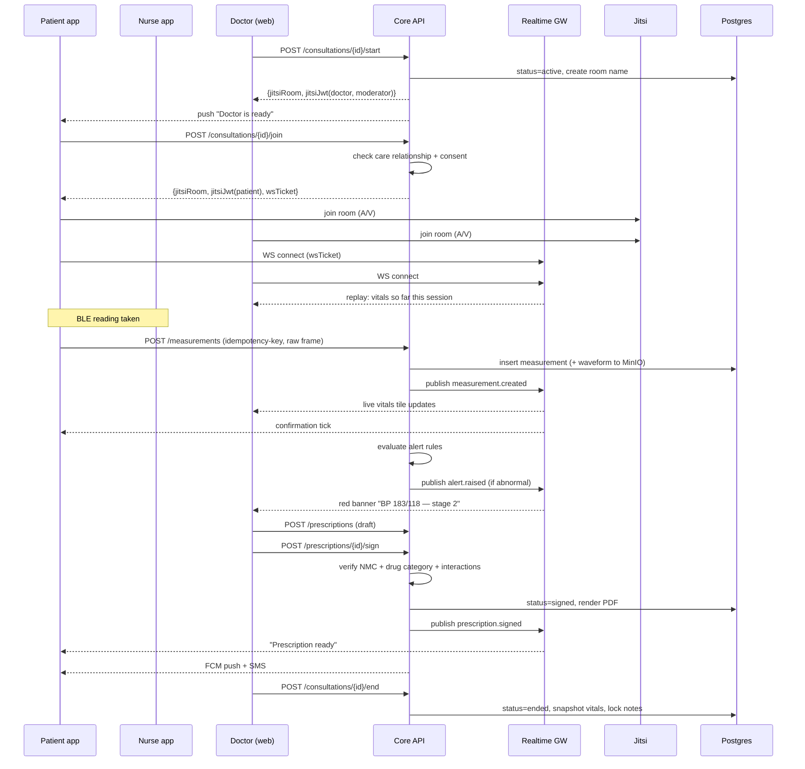
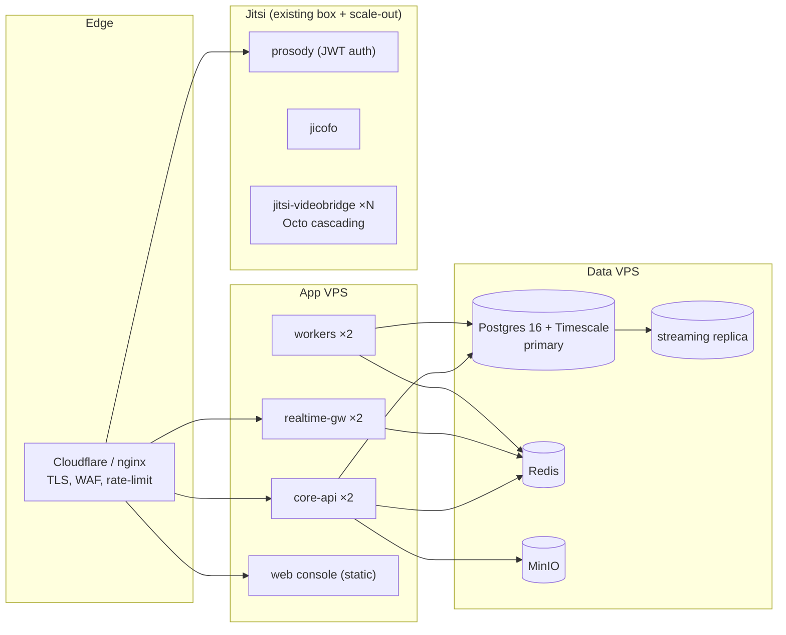

# Aetos One Medical Hub — System Architecture

**Version:** 1.1 (scalability fixes applied)
**Date:** 13 September 2026
**Owner:** Aetos Tech Labs LLP
**Status:** Architecture proposal — no code written yet

> **v1.1 changes** (from the Scalability Review): tenant-context enforcement tightened to `SET LOCAL` inside an explicit transaction with an RLS index rule (§6.5); `access_log` given a real sizing and retention design (§7.6); media capacity, 360p cap and audio-only fallback added (§8.5); deployment topology updated for multi-JVB with Octo (§12).

---

## 0. Decisions locked before writing this document

| # | Decision | Choice | Consequence |
|---|---|---|---|
| D1 | Codebase | **New separate platform.** Not an extension of Aetos One Clinics. | Own repo, own DB, own auth. Clinics stays a separate product; a future SSO bridge is possible but is not in scope. |
| D2 | Video transport | **Self-hosted Jitsi Meet** (already built and running). | A/V is Jitsi. Live *vitals* are **not** carried on Jitsi — see §8 for why and what carries them instead. |
| D3 | Regulatory posture | **India: DPDP Act 2023 + MoHFW Telemedicine Practice Guidelines 2020 + ABDM/ABHA.** | India-only data residency, NMC registration verification for every prescribing doctor, consent ledger, drug-category enforcement on e-prescriptions, full audit trail. |
| D4 | Depth of this document | Full architecture: context, services, ERD, RBAC matrix, API surface, realtime flows, deployment, phases. | No implementation in this pass. |

---

## 1. Product scope

### 1.1 What exists today (inputs, not to be rebuilt)

- **Aetos One Health** — native Android app (Kotlin/Compose, `com.aetostechlabs.aetosonehealth`) that talks BLE **directly** to the ikinloop ECG2 and the RBP blood-pressure cuff. Currently offline-only (no `INTERNET` permission), stores raw readings in SQLite, applies calibration at display time.
- **Jitsi Meet** — self-hosted meeting platform.
- Device protocol decoders + DSP, proven byte-for-byte against real hardware.

### 1.2 What the Medical Hub adds

Five surfaces over one backend:

| Surface | Users | Tech |
|---|---|---|
| **Patient app** (evolution of Aetos One Health) | Patients, caregivers | Android native (Kotlin/Compose) — add network layer + auth + consult |
| **Clinician app** | Doctors, nurses | Android native — separate app ID, shared modules |
| **Clinician web console** | Doctors, nurses, front desk | React + Vite + TypeScript |
| **Admin console** | Platform owner, org owners, org/branch admins | Same React app, role-gated routes |
| **Backend platform** | — | NestJS (TypeScript) modular monolith + Postgres + TimescaleDB |

### 1.3 The core clinical loop this must support

```
Patient (or nurse) joins a live consult
        ↓
Device takes a reading (BLE → phone)
        ↓
Reading streams live into the consult room — doctor sees it as it happens
        ↓
Doctor reviews, dictates/keys findings, issues a digitally-signed e-prescription
        ↓
Patient receives it in-app, with a dosing schedule and reminders
        ↓
Adherence events flow back; abnormal vitals raise alerts; follow-up is scheduled
```

Everything else in this architecture exists to make that loop safe, auditable and multi-tenant.

---

## 2. Architectural principles

1. **Modular monolith first, services only where forced.** One NestJS deployable with hard module boundaries (own Prisma schema namespaces, no cross-module repository imports — only service interfaces). Extract to a service only when a module needs independent scaling or a different runtime. The one exception at launch is the **realtime gateway** (§8), which is extracted on day one because its scaling profile is completely different.
2. **Tenant isolation enforced at the database, not the ORM.** Postgres **Row-Level Security** with `app.current_org_id` / `app.current_branch_ids` session GUCs. An ORM bug must not be able to leak another org's patients.
3. **Care-relationship is a first-class check.** Being a `DOCTOR` in an org does not grant access to every patient in that org. Access to a patient record requires an active *care relationship* (assignment, appointment, or explicit break-glass). RBAC alone is insufficient for clinical data (§6.4).
4. **Raw in, derived at read.** Measurements are stored exactly as the device emitted them (raw frame hex retained). Calibration, unit conversion and interpretation are applied on read. This is already the rule in the Android app — the backend keeps it.
5. **Every clinical write is append-only and audited.** Prescriptions, notes and diagnoses are never updated in place; they are superseded by a new version. `audit_log` is write-only and separately retained.
6. **Fail closed.** No care relationship → 404 (not 403; a 403 leaks existence). No verified NMC registration → cannot sign a prescription. No consent record → no ABDM data exchange.
7. **The phone is not trusted.** It is an authenticated client, not an authority. It cannot set timestamps that the server accepts blindly, cannot mark a prescription fulfilled, cannot assign itself to a patient.

---

## 3. System context



---

## 4. Service decomposition

### 4.1 Core API — internal modules

Each is a NestJS module with its own controllers, services, Prisma models and event emitters. Cross-module calls go through a published interface only.

| Module | Responsibility |
|---|---|
| `identity` | Users, credentials, OTP, sessions, refresh-token rotation, MFA, device trust |
| `tenancy` | Organizations, branches, memberships, invitations, subscription tier |
| `authz` | Roles, permissions, scope resolution, policy evaluation, care-relationship checks |
| `directory` | Doctor profiles, NMC verification, specialities, availability, nurse/staff profiles |
| `patients` | Patient demographics, MRN allocation per org, ABHA linkage, merge/dedupe |
| `care` | Care teams, patient↔clinician assignments, referrals, break-glass |
| `scheduling` | Slots, appointments, waitlist, cancellations, no-shows |
| `consultation` | Encounters, participant roster, Jitsi room lifecycle, notes, vitals snapshot, recording metadata |
| `devices` | Device registry, bindings, firmware/model catalog, calibration profiles |
| `telemetry` | Measurement ingest, dedupe, validation, waveform handoff to object store, ranges |
| `alerts` | Threshold rules, abnormal-value detection, escalation chains, acknowledgements |
| `prescriptions` | Drug catalog, prescription versions, digital signature, PDF generation, dispense |
| `adherence` | Medication schedules, dose events, reminder orchestration, adherence scoring |
| `documents` | Attachments, lab reports, consent artefacts, signed-URL issuance |
| `notifications` | Multi-channel fan-out (push / SMS / WhatsApp / email), templates, preferences |
| `abdm` | ABHA create/link, HIP care-context linking, HIU consent requests, FHIR R4 mapping |
| `audit` | Append-only audit log, access log, export for regulators |
| `admin` | Platform-level operations, feature flags, branding, impersonation (audited) |
| `reporting` | Aggregates, org dashboards, exports |

### 4.2 Realtime Gateway (separate deployable)

Node + `ws` (or NestJS WebSocket adapter) behind the same JWT issuer. Holds only ephemeral state; all durable writes go through the Core API. Horizontally scaled behind Redis pub/sub so any pod can serve any room.

### 4.3 Workers (separate deployable, same image)

BullMQ consumers: alert evaluation, reminder dispatch, prescription PDF rendering, ABDM sync, waveform post-processing, nightly adherence scoring, retention/purge jobs.

---

## 5. Identity, tenancy and org hierarchy

### 5.1 Identity model

**One `user` row per human being, globally unique on a verified phone number and/or verified email.** This is the key requirement from the brief and it drives everything else.

- `phone_e164` and `email` are each `UNIQUE` where non-null, and only become usable identifiers once `phone_verified_at` / `email_verified_at` is set.
- A user can hold **many roles across many orgs simultaneously** — a doctor at Branch A, an org admin at Org B, and a patient at Org C. Roles never live on the user row; they live on `membership` rows.
- **Patient-ness is a role, not a user type.** Dr. Sharma can be a patient of Dr. Mehta. This is common and a design that forks "patient accounts" from "staff accounts" breaks on it.
- Login methods: phone OTP (primary, India), email + password, email magic link. Social login deliberately excluded at launch (auditability).

### 5.2 Tenancy hierarchy



**Rules:**

- A **branch** is the unit of physical operation and the default scope for staff. Staff memberships are branch-scoped; org-wide staff get an explicit org-scope membership.
- A **patient** is registered at **org** level with an org-unique MRN, and carries a *preferred branch*. This avoids a patient having three disconnected records after visiting three branches of the same chain.
- The same human seen at two different **orgs** has two `patient` records under one `user` — deliberately. Orgs are separate data controllers; their records must not merge. Cross-org sharing happens only through ABDM consent.
- **Platform owner** (`SUPER_ADMIN`) can see org metadata and operate the platform but **cannot read clinical data** without a logged break-glass with a stated reason. This is the difference between a system administrator and a data breach.

### 5.3 Registration & onboarding flows

| Flow | Path |
|---|---|
| Patient self-registers | App → phone OTP → user created → self-registers into an org by code/QR, or stays "unaffiliated" until a doctor adds them |
| Doctor adds a patient | Doctor searches by phone/email → if user exists, sends a link request the patient must approve; if not, creates a provisional patient record + invite SMS |
| Org created | Platform admin creates org + first ORG_OWNER, or self-serve signup with domain/GST verification |
| Branch created | ORG_OWNER / ORG_ADMIN |
| Staff invited | Email/SMS invite → accept → membership activated → for doctors, NMC verification gate before any prescribing right is granted |

**The "doctor adds a patient" consent step is non-negotiable.** A clinician must not be able to unilaterally attach themselves to an existing person's health record. Provisional records (created by the clinic, not yet claimed) are a separate state and are merged into the real user on claim.

---

## 6. RBAC

### 6.1 Model shape

Role-based with **scoped assignments** and an **ABAC overlay** for clinical data.

```
user ──< membership >── organization
             │
             ├── scope_type:  PLATFORM | ORG | BRANCH
             ├── scope_id:    null | org_id | branch_id
             └── role_id ──< role_permission >── permission (resource:action)
```

- Permissions are strings: `patient:read`, `prescription:sign`, `branch:create`, `measurement:write`…
- Roles are **templates**; orgs may clone a system role into a custom role and adjust permissions within a permitted subset. System roles cannot be edited.
- Effective permission = union of all active memberships, evaluated against the **requested scope**.

### 6.2 System roles

| Role | Scope | Purpose |
|---|---|---|
| `SUPER_ADMIN` | PLATFORM | Aetos staff. Platform ops, org lifecycle, no clinical read without break-glass. |
| `SUPPORT_AGENT` | PLATFORM | Read-only platform metadata, ticket handling, no clinical data at all. |
| `ORG_OWNER` | ORG | Full control of one org incl. billing, deletion, role customisation. |
| `ORG_ADMIN` | ORG | Everything except billing + org deletion + ownership transfer. |
| `BRANCH_ADMIN` | BRANCH | Manage staff, schedules, patients of one branch. |
| `DOCTOR` | BRANCH or ORG | Clinical: consult, diagnose, prescribe (gated on NMC verification). |
| `NURSE` | BRANCH | Assist consults, take/attach readings, view assigned patients, **cannot prescribe**. |
| `FRONT_DESK` | BRANCH | Register patients, book/reschedule, check-in. **No clinical data** beyond demographics. |
| `LAB_TECH` | BRANCH | Upload lab reports against an order. No consult access. |
| `PHARMACIST` | BRANCH/ORG | View + dispense prescriptions, record dispense. No diagnosis access. |
| `PATIENT` | SELF | Own record, own consults, own prescriptions, own devices. |
| `CAREGIVER` | DELEGATED | Patient-granted, time-boxed, revocable access to another patient's record (elderly parent, child). |

### 6.3 Permission matrix

`✔` = allowed in scope · `A` = only for **assigned** patients (care relationship required) · `O` = own record only · `B` = break-glass, logged and alerted · `—` = denied

| Resource : action | SUPER_ADMIN | ORG_OWNER | ORG_ADMIN | BRANCH_ADMIN | DOCTOR | NURSE | FRONT_DESK | LAB_TECH | PHARMACIST | PATIENT | CAREGIVER |
|---|---|---|---|---|---|---|---|---|---|---|---|
| org:create | ✔ | — | — | — | — | — | — | — | — | — | — |
| org:read | ✔ | ✔ | ✔ | ✔ | ✔ | ✔ | ✔ | ✔ | ✔ | — | — |
| org:update | ✔ | ✔ | ✔ | — | — | — | — | — | — | — | — |
| org:delete | ✔ | ✔ | — | — | — | — | — | — | — | — | — |
| org:billing | — | ✔ | — | — | — | — | — | — | — | — | — |
| branch:create | ✔ | ✔ | ✔ | — | — | — | — | — | — | — | — |
| branch:update | ✔ | ✔ | ✔ | ✔ | — | — | — | — | — | — | — |
| branch:delete | ✔ | ✔ | ✔ | — | — | — | — | — | — | — | — |
| member:invite | ✔ | ✔ | ✔ | ✔ | — | — | — | — | — | — | — |
| member:remove | ✔ | ✔ | ✔ | ✔ | — | — | — | — | — | — | — |
| role:assign | ✔ | ✔ | ✔ | ✔¹ | — | — | — | — | — | — | — |
| role:customise | ✔ | ✔ | — | — | — | — | — | — | — | — | — |
| doctor:verify | ✔ | ✔ | ✔ | — | — | — | — | — | — | — | — |
| patient:create | ✔ | ✔ | ✔ | ✔ | ✔ | ✔ | ✔ | — | — | ✔ (self) | — |
| patient:read:demographics | B | ✔ | ✔ | ✔ | A | A | ✔ | A | A | O | ✔ |
| patient:read:clinical | B | — | — | — | A | A | — | — | — | O | ✔ |
| patient:update | B | ✔ | ✔ | ✔ | A | — | ✔² | — | — | O | ✔ |
| patient:archive | ✔ | ✔ | ✔ | ✔ | — | — | — | — | — | — | — |
| patient:assign_clinician | ✔ | ✔ | ✔ | ✔ | ✔³ | — | ✔ | — | — | — | — |
| appointment:create | ✔ | ✔ | ✔ | ✔ | ✔ | ✔ | ✔ | — | — | O | ✔ |
| appointment:cancel | ✔ | ✔ | ✔ | ✔ | ✔ | — | ✔ | — | — | O | ✔ |
| consult:join | — | — | — | — | A | A | — | — | — | O | ✔⁴ |
| consult:start / end | — | — | — | — | A | — | — | — | — | — | — |
| consult:note:write | — | — | — | — | A | A⁵ | — | — | — | — | — |
| consult:recording:read | B | — | — | — | A | — | — | — | — | O | — |
| measurement:write | — | — | — | — | A | A | — | — | — | O | ✔ |
| measurement:read | B | — | — | — | A | A | — | — | — | O | ✔ |
| measurement:delete | — | — | — | — | — | — | — | — | — | — | — |
| waveform:read | B | — | — | — | A | A | — | — | — | O | ✔ |
| device:register | ✔ | ✔ | ✔ | ✔ | ✔ | ✔ | — | — | — | ✔ (own) | — |
| device:bind_patient | ✔ | ✔ | ✔ | ✔ | ✔ | ✔ | — | — | — | O | ✔ |
| prescription:create_draft | — | — | — | — | A | — | — | — | — | — | — |
| prescription:sign | — | — | — | — | A⁶ | — | — | — | — | — | — |
| prescription:read | B | — | — | — | A | A | — | — | ✔⁷ | O | ✔ |
| prescription:supersede | — | — | — | — | A⁶ | — | — | — | — | — | — |
| prescription:dispense | — | — | — | — | — | — | — | — | ✔ | — | — |
| labreport:upload | — | — | — | ✔ | ✔ | ✔ | — | ✔ | — | O | ✔ |
| labreport:read | B | — | — | — | A | A | — | A | — | O | ✔ |
| alert:acknowledge | — | — | — | ✔ | A | A | — | — | — | — | — |
| alertrule:manage | ✔ | ✔ | ✔ | ✔ | ✔ | — | — | — | — | — | — |
| consent:grant | — | — | — | — | — | — | — | — | — | O | — |
| consent:revoke | — | — | — | — | — | — | — | — | — | O | ✔ |
| abdm:link_carecontext | — | ✔ | ✔ | ✔ | A | — | ✔ | — | — | O | — |
| audit:read | ✔ | ✔ | ✔ | ✔⁸ | O | O | O | O | O | O⁹ | — |
| branding:manage | ✔ | ✔ | ✔ | — | — | — | — | — | — | — | — |
| report:org_analytics | ✔ | ✔ | ✔ | ✔⁸ | — | — | — | — | — | — | — |
| data:export | ✔ | ✔ | — | — | — | — | — | — | — | O¹⁰ | — |

¹ Branch admin may assign roles at or below `BRANCH_ADMIN`, within their branch only.
² Front desk may edit demographics/contact only, never clinical fields.
³ A doctor may assign another clinician to a patient they already treat (referral / care team).
⁴ Only if the patient explicitly permitted caregiver presence in consults.
⁵ Nurse notes are stored as a distinct, separately-attributed note type; they never overwrite a doctor's note.
⁶ Requires `nmc_verified = true` **and** an active consultation or a follow-up window open on a prior consultation with that patient.
⁷ Pharmacist sees drug, dose, duration, prescriber and validity — not the diagnosis or the notes.
⁸ Scoped to their branch.
⁹ A patient can see *who accessed their record and when* — this is a DPDP-friendly feature and a strong trust signal.
¹⁰ Right to data portability under DPDP: patient can export their full record as FHIR R4 bundle + PDF.

### 6.4 The care relationship (ABAC overlay)

`A` in the matrix above resolves at request time against `care_relationship`:

A clinician has access to a patient if **any** of:
1. An active row in `patient_assignment` (care team member, primary physician).
2. An appointment between them with status in `{scheduled, in_progress, completed}` and `now() < completed_at + follow_up_window` (default 30 days, org-configurable).
3. They are a participant in an active consultation with that patient.
4. An active referral grants them time-boxed access.
5. **Break-glass**: explicit emergency override, requiring a typed reason, valid 60 minutes, which fires a real-time notification to the org owner and writes a high-severity audit entry. Never silent.

Relationships **expire**. A doctor who saw a patient once in 2024 does not still have their ECG history open in 2026.

### 6.5 Enforcement layers

| Layer | Mechanism |
|---|---|
| Route | `@RequirePermission('prescription:sign')` decorator + guard |
| Scope | Guard resolves `orgId`/`branchId` from the path/body, checks the membership set |
| Relationship | `@RequireCareRelationship('patientId')` guard hits the `care` module |
| Data | Postgres RLS policies on every tenant table, driven by **transaction-scoped** session GUCs (see the rule below) |
| Field | Response serialisation groups (`@Expose({groups:['clinical']})`) so a front-desk token cannot receive clinical fields even if a query over-fetches |
| Audit | Interceptor writes an `access_log` row for every read of clinical data, not just writes |

Five layers sounds like a lot. It is what stops a single missed `WHERE org_id = ?` from becoming a reportable breach.

#### The tenant-context rule (non-negotiable)

Connection pooling and RLS session variables are a documented way to leak one tenant's data to another, and the failure is silent. The rule:

```sql
BEGIN;
  SET LOCAL app.current_user_id  = '…';
  SET LOCAL app.current_org_id   = '…';
  SET LOCAL app.current_branches = '…';
  -- all work for this request
COMMIT;
```

- **`SET LOCAL`, never `SET`.** `SET LOCAL` dies with the transaction. A plain `SET` on a PgBouncer transaction-pooled connection persists and is inherited by whichever tenant borrows that connection next.
- **Every request runs inside an explicit transaction**, including read-only ones. A Prisma extension/middleware opens it, sets the GUCs, and runs the handler. Issuing a query outside that wrapper must be structurally impossible, not merely discouraged.
- **A test proves it.** An integration test that sets a GUC, returns the connection to the pool, and asserts the next borrower sees no tenant context. It fails the build if the wrapper is bypassed.
- **PgBouncer runs in transaction mode.** Session mode would work but caps concurrency at the pool size.
- **Every RLS policy's columns are indexed, `org_id` leading.** An unindexed RLS predicate silently converts point lookups into sequential scans — the system stays correct and gets slow exactly when volume arrives.

---

## 7. Data model

### 7.1 Identity, tenancy, authorization



### 7.2 Clinical core



### 7.3 Devices, telemetry, prescriptions, adherence



### 7.4 Cross-cutting tables

| Table | Notes |
|---|---|
| `audit_log` | `id, actor_user_id, actor_role, org_id, action, resource_type, resource_id, before, after, ip, user_agent, request_id, severity, created_at`. Append-only; `REVOKE UPDATE, DELETE` from the app role. Partitioned monthly, retained 7 years (medical-records norm). |
| `access_log` | Every *read* of clinical data. **The largest table in the system** — see §7.6 for its sizing and retention design. Surfaces the patient-facing "who saw my record" view. |
| `notification` | Channel, template, payload, status, provider message id, retries. |
| `attachment` | Generic object-store reference with owner scope + virus-scan status. |
| `abdm_link` | `patient_id, care_context_id, hip_id, linked_at, status`. |
| `feature_flag` | Per-plan and per-org toggles. |
| `idempotency_key` | For all mutating API calls from mobile clients on flaky networks. |

### 7.5 Storage choices

| Data | Store | Why |
|---|---|---|
| All relational + `measurement` | PostgreSQL 16 | One DB, real joins, RLS. |
| `measurement`, `access_log`, `dose_event` | TimescaleDB hypertables on the same Postgres | Time-partitioned, compressed after 30 days, continuous aggregates for trend charts. Avoids a second database. |
| ECG waveforms, prescription PDFs, lab reports, recordings | MinIO (self-hosted, S3 API) | Blobs do not belong in Postgres. Server-side encryption, object-lock for signed prescriptions. |
| Sessions, rate limits, realtime presence, job queues | Redis 7 | — |
| Search (patients, drugs) | Postgres `pg_trgm` + GIN at launch; OpenSearch only if it stops scaling | Don't add Elasticsearch on day one. |

---

### 7.6 `access_log` — sized for what it actually becomes

Every read of clinical data is logged. At 10 000 consults/day that is roughly **500 000 rows/day, 180 million rows/year** — larger than every clinical table in this system combined, and larger than `measurement` by an order of magnitude. This is normal for healthcare and it is the table people under-plan.

Designed for from the first migration, not retrofitted after an incident:

| Control | Spec |
|---|---|
| Partitioning | Timescale hypertable, **1-month chunks**, `(org_id, created_at)` |
| Compression | Native compression after **7 days**, segment by `org_id`, order by `created_at DESC`. Expect 10–20× on this shape |
| Tablespace | Its own tablespace on cheaper/slower disk — it is append-only and rarely read hot |
| Hot retention | 12 months queryable in Postgres |
| Cold retention | 13–36 months exported to object storage as partitioned Parquet; the "who saw my record" API reads it back on demand and says so ("older activity may take a moment") |
| Purge | Hard delete past the 3-year policy, by chunk drop, never by `DELETE` |
| Patient-facing view | Reads a **continuous aggregate** (per day, per accessing clinician), never the raw table |
| Write path | Batched async writes off the request path via a queue — a logging stall must never stall a clinician |
| What is NOT logged | List-view reads of demographics-only fields, and the patient's own reads of their own record. Logging everything is how this table becomes unaffordable without becoming more useful |

`audit_log` (writes) is far smaller — roughly 1–2% of this volume — and keeps the simpler monthly-partition + 7-year retention design.

---

## 8. Realtime: live consultation + live vitals

### 8.1 Why vitals do not ride on Jitsi

Jitsi is excellent at A/V. Using its data channel for clinical measurements would mean: no server-side persistence guarantee, no replay if a participant joins late, no delivery when the doctor's video drops, and a clinical record whose source of truth is a peer-to-peer channel. That is not acceptable for a reading that lands in a medical record.

**Split the planes:**

- **Media plane** — Jitsi Meet, self-hosted, rooms authorised by short-lived JWT minted by the Core API (Prosody `token` auth module). Room names are opaque UUIDs, never guessable, and expire.
- **Data plane** — your own WebSocket gateway. Every measurement is written to Postgres **first**, then fanned out over Redis pub/sub to everyone in the consultation room. Late joiners get a replay of the session so far. If the WS drops, the reading is still in the record.

### 8.2 Live consult sequence



### 8.3 ECG waveform streaming (the one high-bandwidth case)

A 250 Hz single-lead ECG is ~500 B/s raw. Sent as base64 JSON over WS this is ~11 KB/s per viewer — acceptable, but wasteful. Approach:

- Phone buffers 1-second frames, downsamples to a display-rate envelope (min/max per 10 ms bucket) for the **live** view — ~60 points/s, trivially small.
- The **full-fidelity** samples are uploaded as a binary chunked PUT to the waveform endpoint (resumable, gzip), landing in MinIO. The doctor's "full trace" view reads from there.
- This means a doctor on a poor connection still sees a live rhythm, and the diagnostic-quality trace is never lost to a dropped socket.

### 8.4 Offline-first on the phone

The patient app already works offline. Preserve that:

- Local SQLite stays the write-ahead store. Every reading gets a client-generated UUID used as the server idempotency key.
- A sync worker drains the outbox on connectivity; server rejects duplicates silently with `200 + already_exists`.
- `measured_at` (device/phone clock) and `received_at` (server clock) are both stored. If the clock skew exceeds a threshold, the reading is flagged `clock_suspect` rather than silently trusted or dropped.

---

### 8.5 Media capacity and video policy

Video bandwidth is the first hard wall this system hits and the largest single infrastructure cost — larger than compute and storage combined. It is also the one that degrades *visibly* (choppy calls, support tickets) long before anything actually fails. So the policy is set in the architecture, not left to defaults.

**Capacity arithmetic:** 10 000 consults/day × 20 min × 2 participants = 400 000 participant-minutes/day. Compressed into an 8-hour clinic day that is ~830 concurrent participants average, ~1 600 at peak. One JVB comfortably carries 300–500 before packet loss shows, so that load needs **4–6 bridges with Octo cascading**, not one.

**Policy, enforced in the client config — not advisory:**

| Rule | Value | Why |
|---|---|---|
| Max video resolution | **360p / 24 fps** for consults | Clinically sufficient for a teleconsult; roughly halves bandwidth against 720p. A doctor who needs to see a lesion asks for a photo upload, which is higher fidelity than any video stream |
| Simulcast | On | Lets the bridge drop layers for weak receivers instead of dropping the call |
| Last-N | 2 (+1 for a nurse or caregiver) | No reason to forward more streams than are on screen |
| Audio-only mode | **First-class, one tap, never a failure state** | ~50 kbps vs ~1.5 Mbps. On a bad rural link this is the difference between a consult and a cancelled appointment |
| Auto-degrade | Drop to audio-only automatically on sustained packet loss, with a visible banner and a one-tap return to video | Degrade deliberately rather than letting the call disintegrate |
| Screen share | Disabled by default, org-enable | It is the most expensive stream in the room and is rarely needed clinically |
| Recording | Off by default; where enabled, record **audio-only** unless video is explicitly consented | Storage and consent cost both drop by an order of magnitude |

**Hosting:** model egress cost before committing. At ~1.5 Mbps × 1 600 peak participants that is ~2.4 Gbps sustained — per-GB egress pricing is ruinous at this shape; committed-bandwidth or unmetered hosting is the right purchase, and it must be decided before the load arrives, not after the first invoice.

**Regionalisation** (needed at national scale): JVBs placed near patients, Octo cascading between regions, and consult routing that prefers the closest healthy bridge. This is the latency fix as much as the capacity fix.

---

## 9. Prescription safety and Indian telemedicine rules

Enforced in code at `POST /prescriptions/:id/sign`, not left to clinician discipline:

1. **Prescriber eligibility** — `doctor_profile.nmc_verification_status = verified`, membership active, not suspended.
2. **Modality vs drug category** — MoHFW Telemedicine Practice Guidelines 2020 restrict what may be prescribed by which mode:
   - **List O** — over-the-counter, any mode.
   - **List A** — first video consult, or follow-up of any mode.
   - **List B** — follow-up only, for a condition already prescribed for.
   - **Prohibited** — Schedule X, narcotics/psychotropics: **blocked outright**, no override.
   The `drug.telemedicine_category` column plus the consultation's mode and first/follow-up status decide this. A blocked attempt is logged.
3. **Allergy and interaction check** — against `patient.allergies` and `drug.interactions`; hard block on known allergy, soft warning with mandatory acknowledgement on interaction.
4. **Signature** — typed-credential signing at MVP (name + registration number + server-side timestamp, PDF checksummed and object-locked); DSC/eSign integration in phase 3 for a legally stronger artefact.
5. **Immutability** — a signed prescription is never edited. A correction creates version n+1 with `supersedes` set; both remain retrievable and the superseded one is watermarked in the PDF.
6. **Mandatory fields on the PDF** — patient name/age/gender, date, doctor's name, qualification, **registration number**, signature, and the explicit note that it was issued via teleconsultation.

---

## 10. API surface

REST/JSON, `/api/v1`, JWT bearer. `X-Org-Id` header (or path prefix) selects the active tenant when a user has multiple memberships. All mutations accept `Idempotency-Key`.

### Auth & identity
```
POST   /auth/otp/request              { phone | email }
POST   /auth/otp/verify               → { access, refresh, memberships[] }
POST   /auth/password/login
POST   /auth/token/refresh            (rotating refresh, reuse-detection)
POST   /auth/logout
GET    /me                            → profile + all memberships + permissions
PATCH  /me
GET    /me/sessions      DELETE /me/sessions/:id
POST   /me/mfa/enroll    POST /me/mfa/verify
GET    /me/access-log                 "who viewed my record"
POST   /me/export                     DPDP data portability (async → signed URL)
```

### Platform (SUPER_ADMIN)
```
GET    /platform/organizations        POST /platform/organizations
PATCH  /platform/organizations/:id    POST /platform/organizations/:id/suspend
GET    /platform/metrics
POST   /platform/break-glass          { orgId, patientId, reason } → time-boxed grant
GET    /platform/feature-flags        PATCH /platform/feature-flags/:key
```

### Org & branch
```
GET    /orgs/:orgId                   PATCH /orgs/:orgId
GET    /orgs/:orgId/branding          PUT   /orgs/:orgId/branding
GET    /orgs/:orgId/branches          POST  /orgs/:orgId/branches
GET    /branches/:id                  PATCH /branches/:id   DELETE /branches/:id
GET    /orgs/:orgId/members?role=&branchId=&status=
POST   /orgs/:orgId/invitations       POST /invitations/:token/accept
PATCH  /memberships/:id               { roleId, branchId, status, endsAt }
DELETE /memberships/:id
GET    /orgs/:orgId/roles             POST /orgs/:orgId/roles   (custom role)
GET    /permissions                   catalogue for the role editor
```

### Directory
```
GET    /orgs/:orgId/doctors?speciality=&branchId=
POST   /doctors/:userId/verify-nmc    → queues registry check
GET    /doctors/:userId/availability  PUT /doctors/:userId/availability
GET    /orgs/:orgId/staff
```

### Patients
```
GET    /orgs/:orgId/patients?q=&branchId=&assignedTo=me
POST   /orgs/:orgId/patients                        (provisional or linked)
GET    /patients/:id                                (care-relationship gated)
PATCH  /patients/:id
POST   /patients/:id/link-user      { phone|email } → sends consent request
POST   /patients/:id/claim          patient-side acceptance
POST   /patients/:id/merge          { intoPatientId }
POST   /patients/:id/archive
GET    /patients/:id/timeline       unified: consults, measurements, prescriptions, labs
GET    /patients/:id/assignments    POST /patients/:id/assignments   DELETE /assignments/:id
GET    /patients/:id/caregivers     POST /patients/:id/caregivers    DELETE /caregivers/:id
```

### Scheduling & consultation
```
GET    /orgs/:orgId/slots?doctorId=&date=
POST   /appointments                 PATCH /appointments/:id   POST /appointments/:id/cancel
POST   /appointments/:id/check-in
POST   /appointments/:id/consultation      → creates consultation
POST   /consultations/:id/start            (doctor)  → jitsi room + moderator JWT
POST   /consultations/:id/join             (any participant) → jitsi JWT + ws ticket
POST   /consultations/:id/invite           { userId, roleInConsult }  nurse/caregiver
POST   /consultations/:id/end
GET    /consultations/:id                   roster, vitals snapshot, notes, Rx
POST   /consultations/:id/notes             PATCH /notes/:id  (versioned)
POST   /consultations/:id/recording/consent
GET    /consultations/:id/recording         signed URL, audited
```

### Devices & telemetry
```
GET    /device-models                POST /device-models        (platform)
GET    /orgs/:orgId/devices          POST /orgs/:orgId/devices
POST   /devices/:id/bind             { patientId, bindingType }
POST   /devices/:id/unbind
POST   /measurements                 single, idempotent
POST   /measurements/batch           offline outbox drain, ≤500 per call
GET    /patients/:id/measurements?kind=&from=&to=&page=
GET    /measurements/:id
POST   /measurements/:id/waveform    chunked binary upload → MinIO
GET    /measurements/:id/waveform    signed URL
GET    /patients/:id/trends?kind=bp&bucket=1d&from=&to=   Timescale continuous aggregate
```

### Alerts
```
GET    /orgs/:orgId/alert-rules      POST /orgs/:orgId/alert-rules
GET    /patients/:id/alert-rules     POST /patients/:id/alert-rules
GET    /alerts?status=open&branchId=
POST   /alerts/:id/acknowledge       POST /alerts/:id/resolve
```

### Prescriptions & adherence
```
GET    /drugs?q=&category=
POST   /consultations/:id/prescriptions        → draft
PATCH  /prescriptions/:id                      draft only
POST   /prescriptions/:id/items                DELETE /prescription-items/:id
POST   /prescriptions/:id/validate             dry-run of every safety gate
POST   /prescriptions/:id/sign                 → immutable + PDF
POST   /prescriptions/:id/supersede            → new version
GET    /prescriptions/:id                      GET /prescriptions/:id/pdf (signed URL)
GET    /patients/:id/prescriptions
POST   /prescriptions/:id/dispense             pharmacist
GET    /patients/:id/medication-schedules
POST   /dose-events/:id/taken     POST /dose-events/:id/skip
GET    /patients/:id/adherence?from=&to=
```

### Documents, consent, ABDM
```
POST   /patients/:id/attachments     GET /attachments/:id  (signed URL)
POST   /patients/:id/lab-reports     GET /patients/:id/lab-reports
GET    /patients/:id/consents        POST /patients/:id/consents   POST /consents/:id/revoke
POST   /abdm/abha/create             POST /abdm/abha/link
POST   /abdm/care-contexts/link
POST   /abdm/consent-requests        (HIU flow)
GET    /abdm/health-info/:txnId
```

### Audit & reporting
```
GET    /orgs/:orgId/audit-log?actor=&resource=&from=&to=
GET    /orgs/:orgId/reports/summary
GET    /orgs/:orgId/reports/utilisation?branchId=
POST   /orgs/:orgId/reports/export
```

### WebSocket events (realtime gateway)

Client → server: `subscribe:consultation`, `subscribe:patient`, `subscribe:alerts`, `presence:ping`
Server → client: `measurement.created`, `waveform.chunk`, `alert.raised`, `alert.acknowledged`, `prescription.signed`, `consultation.participant_joined`, `consultation.participant_left`, `consultation.ended`, `note.updated`, `device.status`

---

## 11. Security

| Control | Implementation |
|---|---|
| Transport | TLS 1.3 everywhere; HSTS; certificate pinning in both Android apps |
| At rest | Postgres on LUKS volume + `pgcrypto` column encryption for `abha_number`, `phone_e164` hash-index; MinIO SSE-KMS |
| Tokens | Access JWT 15 min (RS256, rotating JWKS); refresh 30 d, rotating, reuse-detection revokes the family |
| Mobile storage | Android Keystore for refresh token; SQLCipher for the local clinical cache; screenshot blocking on clinical screens |
| Jitsi | Prosody JWT auth, room name = UUIDv4, JWT TTL 10 min, lobby enabled, moderator = doctor only |
| Rate limiting | Per-IP and per-user, stricter on OTP (5/hour/number) and on patient search |
| Input | Zod/class-validator on every DTO; no raw SQL outside reviewed repository methods |
| Secrets | Not in env files in prod — Docker secrets or Vault; no secret ever in the repo |
| PII in logs | Structured logging with a redaction serialiser; phone/email/MRN never logged in plaintext |
| Backups | Nightly `pg_dump` + WAL archiving to a second location; MinIO versioning + object-lock; **restores tested monthly, not just taken** |
| Vulnerability | Dependency scanning in CI; container image scanning; quarterly pen-test before any hospital-chain customer |
| Break-glass | Typed reason, 60-minute grant, notifies org owner immediately, permanent high-severity audit entry |

**DPDP Act 2023 obligations** designed in: purpose-limited consent records, data-principal rights endpoints (access, correction, erasure, portability), breach-notification runbook, named Data Protection Officer, India-only hosting, and retention schedules per data class (clinical 7 y, access logs 3 y, OTP 15 min, recordings per consent).

---

## 12. Deployment topology

Target: your existing VPS fleet, Docker Compose at MVP, migrating to k3s when a second env or autoscaling is needed.



- **Environments**: `dev` (aiserver, native processes), `staging` (single VPS, full stack), `prod` (separate app/data/media hosts).
- **CI/CD**: GitHub Actions → build image → run migrations in a job → rolling restart. Prisma migrations are forward-only; every migration reviewed for lock duration on `measurement`.
- **Observability**: OpenTelemetry traces → Tempo/Jaeger; Prometheus + Grafana (per-endpoint latency, WS connection count, queue depth, alert-evaluation lag); Loki for logs; Sentry for exceptions. A dedicated dashboard for the **clinical** SLIs: consult join success rate, measurement ingest lag, prescription sign failure rate.
- **Media scale-out**: one Prosody/Jicofo control plane, **N videobridges added horizontally with Octo**. Start at one JVB; add a bridge per ~300 concurrent participants. Bridge selection, packet loss and per-consult bitrate go on the clinical SLI dashboard from day one — video degrades before it fails, so the metric has to lead the complaint.
- **Sharding readiness**: `org_id` is on every clinical row and leads every index, so the shard key is already chosen. Nothing needs to be sharded until a single primary stops coping — but no query may be written that spans orgs, and no clinical table may take a foreign key to the global `user` table beyond a plain `user_id` column. Those two rules keep a 6–10 week migration from becoming a rewrite.
- **DR target**: RPO 15 min (WAL shipping), RTO 4 h. Runbook written and rehearsed before first paying org.

---

## 13. Phased delivery

| Phase | Scope | Exit criterion |
|---|---|---|
| **0 — Foundations** (2 w) | Monorepo, Prisma schema, RLS policies, auth (phone OTP + email), tenancy CRUD, RBAC engine + permission catalogue, audit log, seed data | A user can sign up, create an org and a branch, invite a doctor; every call is permission-checked and audited |
| **1 — Clinical spine** (3 w) | Patients, care relationships, doctor profiles + NMC gate, appointments, web console shell with role-gated nav | Front desk books, doctor sees their queue, access outside a care relationship returns 404 |
| **2 — Telemetry** (3 w) | Device registry + bindings, measurement ingest (single + batch + idempotency), waveform upload, trends, patient app network layer + outbox sync | ECG and BP readings from the real devices land in the cloud and render as trends; offline capture syncs correctly |
| **3 — Live consult** (3 w) | Jitsi JWT integration, consultation lifecycle, realtime gateway, live vitals tiles, nurse-assisted flow, clinical notes | Doctor runs a video consult and watches a BP reading appear live, taken by a nurse on a second device |
| **4 — Prescribing** (3 w) | Drug catalogue, prescription builder, safety gates, MoHFW category enforcement, signing + PDF, patient view | A signed, rule-compliant prescription reaches the patient's phone within seconds |
| **5 — Adherence & alerts** (2 w) | Schedules, reminders, dose events, alert rules + escalation, adherence scoring | Patient gets dose reminders; an out-of-range BP raises a doctor-visible alert |
| **6 — Clinician Android app** (3 w) | Nurse/doctor mobile: queue, consult join, capture readings, view record | Nurse works a full consult from the phone alone |
| **7 — Compliance & scale** (4 w) | ABDM ABHA + care-context linking, consent artefacts, DPDP rights endpoints, DSC/eSign, pharmacist role, reporting, DR rehearsal | ABDM sandbox certification passed; DR restore demonstrated |

Roughly **23 weeks** of focused build to a defensible v1. Phases 0–4 (14 weeks) is the smallest thing that delivers the core loop end to end.

---

## 14. Risks and the honest problems

| Risk | Impact | Mitigation |
|---|---|---|
| **BLE reliability across Android OEMs** | High — the whole data path depends on it | You already hit the notify-vs-indicate bug on the BP cuff. Build a device-compatibility matrix and a diagnostics log uploader (the app already has one — keep it, and let it upload to the backend). Budget real time for Xiaomi/Oppo/Vivo battery-optimisation killing background BLE. |
| **Clock skew from phones** | Medium — a mis-timed reading corrupts a trend | Store both clocks, flag suspect readings, never silently trust `measured_at`. |
| **Care-relationship model too strict or too loose** | High — either clinicians can't work, or it's a breach | Make the follow-up window org-configurable, ship break-glass from day one, and review access-log anomalies weekly during pilot. |
| **NMC verification has no clean public API** | Medium — blocks prescribing | Phase 1: manual admin verification with document upload + a reviewer. Automate later if a usable registry endpoint exists. Don't block the roadmap on it. |
| **ABDM integration effort is routinely underestimated** | Medium | Keep it in phase 7, behind an interface. The core product must work fully without ABDM. |
| **Jitsi at scale** | Medium | One JVB handles ~100 participants comfortably; plan JVB horizontal scaling and Octo before multi-org load. Monitor bridge selection and packet loss per consult. |
| **Measurement table growth** | Medium | Timescale compression after 30 d, waveforms in object storage not in Postgres, continuous aggregates for every chart the UI draws. |
| **Two Android apps, one team** | Medium | Share a `:core-ble`, `:core-data`, `:core-network`, `:core-ui` module set across both app IDs. Do not fork the BLE stack — it took four builds to get the cuff working once. |
| **Scope: this is three products** | High | Device telemetry, telemedicine, and a practice-management console are each a product. Phase 0–4 deliberately builds the thinnest slice of each that makes the loop work. Resist adding billing, inventory, insurance claims or an EMR-grade note system into v1. |

---

## 15. Open decisions for you

1. **Patient app: one app or two?** Extending Aetos One Health means an offline-only, INTERNET-permission-free app gains a network stack — a meaningful privacy-posture change users will notice. Option: keep the offline app as-is and ship "Aetos One Health Connect" as the cloud-connected edition.
2. **Recording consults** — storage cost and consent complexity are non-trivial. Default off, per-org opt-in, explicit patient consent per consult?
3. **Pharmacy** — is dispensing in scope, or does the prescription just leave the platform as a PDF?
4. **Billing/payments** — consultation fees, plan subscriptions: v1 or later?
5. **Languages** — Telugu/Hindi in the patient app from v1, or English-only pilot?
6. **First pilot customer** — a real clinic to design phases 1–4 against beats designing for an imagined one.

---

*Prepared for Ramsay, Aetos Tech Labs LLP. No implementation has been started; this document is the plan to argue with before anything is built.*
